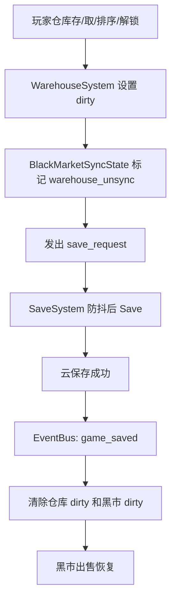
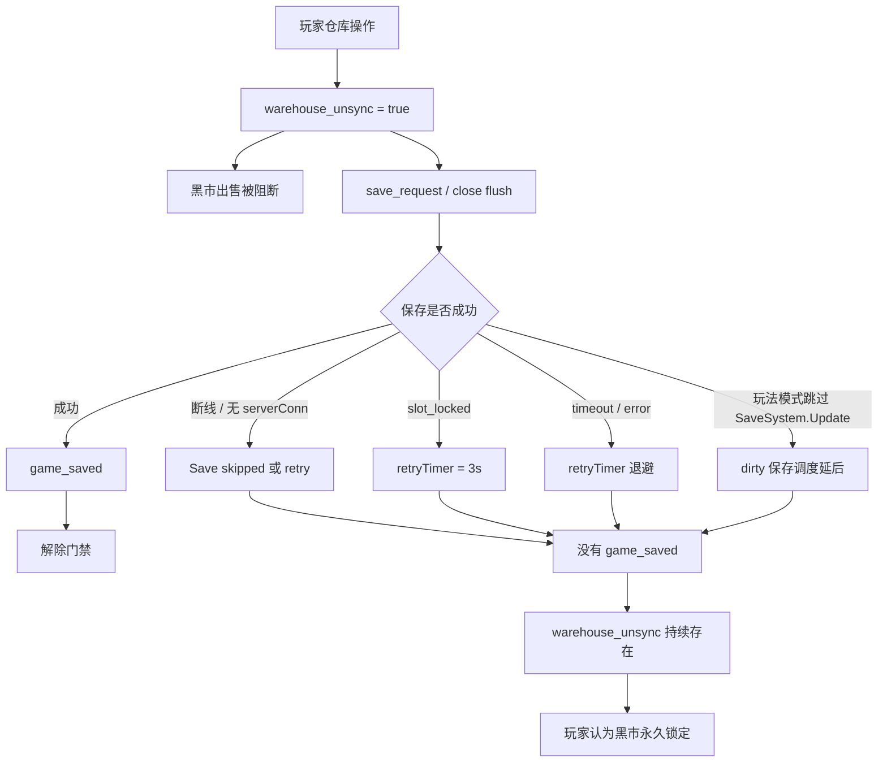

# 仓库后黑市永久锁定问题完整执行方案

日期：2026-06-25  
基准代码：`aabb012 fix: 黑市同步状态修复 + UI优化 + 复盘文档更新`  
范围：黑市出售门禁、仓库变更保存、SaveSystem 保存收口、弱网/断线下的恢复与诊断  
原则：以远端代码为准，不通过清 dirty、跳过保存、超时放行来换体验。

---

## 1. 问题结论

玩家反馈“访问仓库后黑市依然被永久锁定”，当前代码层面可以成立。

最新远端已经完成了部分止血：

1. `BlackMerchantUI.SendToServer()` 在 `serverConn == nil` 时释放 `pendingRequest_`。
2. 黑市相关消耗品置脏后会触发 `save_request`。
3. 仓库 dirty 增加了时间、原因记录。
4. 黑市出售被拦时会显示更准确的仓库/消耗/断线/超时提示。
5. 关闭仓库时，如果本次打开期间有变更，会尝试触发保存。

但当前版本没有真正解决“永久锁定”的根因。

根因是：

1. 仓库操作会设置 `BlackMarketSyncState._dirtyWarehouse = true`。
2. 黑市出售门禁在 `_dirtyWarehouse == true` 时全局阻断出售。
3. `_dirtyWarehouse` 只在 `game_saved` 或 `game_loaded` 后清除。
4. 弱网、断线、`serverConn == nil`、`slot_locked`、保存 timeout、retry、保存调度被玩法模式跳过时，`game_saved` 可能长时间不来。
5. 当前黑市门禁没有主动、统一、可诊断的“推动保存完成”机制，只是提示更清楚。

所以当前优化程度是：能更准确解释为什么被锁，但不能保证锁会尽快解除。

---

## 2. 当前代码事实

### 2.1 仓库如何置脏

仓库成功存/取/解锁/排序后会：

- 设置 `WarehouseSystem._dirty = true`
- 调用 `BlackMarketSyncState.MarkWarehouseOp(reason)`
- 发 `warehouse_changed`
- 发 `save_request`

涉及文件：

- `scripts/systems/WarehouseSystem.lua`

典型路径：

```lua
WarehouseSystem._dirty = true
BlackMarketSyncState.MarkWarehouseOp("retrieve")
EventBus.Emit("warehouse_changed")
EventBus.Emit("save_request")
```

### 2.2 黑市如何阻断

`BlackMarketSyncState.GetSellBlockReason(itemId)` 会先检查同类禁回售，再检查全局未同步状态。

只要 `BlackMarketSyncState.IsBlocked()` 返回 `warehouse_unsync`，黑市出售即被阻断。

当前语义是全局阻断，不是物品粒度阻断。

```lua
if BlackMarketSyncState._dirtyWarehouse then
    return true, "warehouse_unsync"
end
```

### 2.3 dirty 何时清除

`BlackMarketSyncState` 只在以下事件清除 dirty：

```lua
EventBus.On("game_saved", function()
    BlackMarketSyncState.ClearAll()
end)

EventBus.On("game_loaded", function()
    BlackMarketSyncState.ClearAll()
end)
```

`WarehouseSystem._dirty` 也是在 `game_saved` / `game_loaded` 后清除。

### 2.4 保存成功才会发 `game_saved`

`SavePersistence` 只有在云保存成功回调中才会：

```lua
EventBus.Emit("game_saved")
```

这意味着：

- `save_request` 不是保存成功。
- `SaveSession.Flush()` 不是保存成功。
- `SaveSystem.Save()` 被调用也不是保存成功。
- 保存跳过、失败、retry、timeout 都不会清黑市 dirty。

---

## 3. 永久锁定发生链路

### 3.1 正常链路



### 3.2 异常链路



---

## 4. 禁止方案

以下方案禁止作为 P0 使用：

1. 关闭仓库时直接清 `BlackMarketSyncState._dirtyWarehouse`。
2. 发出 `save_request` 后直接清 dirty。
3. `SaveSystem.Save()` 调用后直接清 dirty。
4. 黑市打开时清 dirty。
5. 超过 10 秒或 2 分钟后自动清 dirty。
6. 仓库 dirty 下按“当前出售物品是否相关”直接放行。
7. 保存失败后仍允许出售。
8. 自动重放玩家刚才被拦截的出售请求。

原因：

当前黑市服务端出售仍会读取云端 `save_{slot}` 快照并写回完整 `saveData`。如果客户端仓库/背包变更尚未成功落盘，直接放行出售可能基于旧快照写回，覆盖玩家最新仓库/背包状态。

---

## 5. 执行目标

P0 目标不是“强行解除锁”，而是：

1. 仓库变更后，尽快、安全地推动保存完成。
2. 保存完成后，黑市自动恢复出售。
3. 如果保存不能完成，UI 和日志必须明确说明原因。
4. 不允许通过伪造保存成功或清 dirty 绕过保护。
5. 玩家不应长时间只看到含糊提示。

---

## 6. P0 执行方案

### P0-1：新增保存状态查询 API

文件：

- `scripts/systems/SaveSystem.lua`

新增函数：

```lua
function SaveSystem.GetSaveStatus()
    return {
        loaded = SaveSystem.loaded == true,
        activeSlot = SaveSystem.activeSlot,
        dirty = SaveSystem._dirty == true,
        dirtySinceFlush = SaveSystem._dirtySinceFlush == true,
        saving = SaveSystem.saving == true,
        retryTimer = SaveSystem._retryTimer,
        disconnected = SaveSystem._disconnected == true,
        consecutiveFailures = SaveSystem._consecutiveFailures or 0,
        lastSaveTime = SaveSystem._lastSaveTime or 0,
        hasServerConn = (not CloudStorage.IsNetworkMode()) or (network:GetServerConnection() ~= nil),
    }
end
```

要求：

1. 只读状态，不修改保存生命周期。
2. `CloudStorage` 和 `network` 可直接使用当前模块已有依赖；如果没有就补 require。
3. 不要在该函数里触发保存。

验收：

- 黑市 UI 和测试能读取保存状态。
- 状态至少能区分：未加载、无槽位、正在保存、断线、无连接、retry 中、可保存。

---

### P0-2：新增统一立即保存请求入口

文件：

- `scripts/systems/SaveSystem.lua`

新增函数：

```lua
function SaveSystem.RequestImmediateSave(reason)
    if SaveSystem.loaded and SaveSystem.activeSlot then
        SaveSystem._dirty = true
    end

    local status = SaveSystem.GetSaveStatus()

    if not status.loaded then
        return false, "not_loaded", status
    end
    if not status.activeSlot then
        return false, "no_active_slot", status
    end
    if status.saving then
        return false, "saving", status
    end
    if status.retryTimer then
        return false, "retrying", status
    end
    if status.disconnected then
        return false, "disconnected", status
    end
    if not status.hasServerConn then
        return false, "no_server_conn", status
    end

    print("[SaveSystem] RequestImmediateSave: " .. tostring(reason))
    SaveSystem.Save()
    return true, "started", SaveSystem.GetSaveStatus()
end
```

要求：

1. 统一替代 UI 中散落的直接 `SaveSystem.Save()`。
2. 该函数只代表“保存已启动或无法启动的原因”，不代表保存成功。
3. 不能发 `game_saved`。
4. 不能清 `SaveSystem._dirty`。
5. 不能清 `BlackMarketSyncState` dirty。

验收：

- 在可保存状态下返回 `true, "started"`。
- 在断线/无连接/retry/saving 下返回明确 reason。
- 不破坏原有 `SaveSystem.Save` 行为。

---

### P0-3：仓库关闭改用统一入口

文件：

- `scripts/ui/WarehouseUI.lua`

当前逻辑：

```lua
EventBus.Emit("save_request")
SaveSession.Flush()
if SaveSystem.loaded and ... then
    SaveSystem.Save()
end
```

调整为：

```lua
EventBus.Emit("save_request")
pcall(function()
    require("systems.save.SaveSession").Flush()
end)
pcall(function()
    local SaveSystem = require("systems.SaveSystem")
    local ok, reason, status = SaveSystem.RequestImmediateSave("warehouse_close")
    print("[WarehouseUI] Close save request: ok=" .. tostring(ok)
        .. " reason=" .. tostring(reason)
        .. " saving=" .. tostring(status and status.saving)
        .. " retry=" .. tostring(status and status.retryTimer)
        .. " disconnected=" .. tostring(status and status.disconnected)
        .. " hasConn=" .. tostring(status and status.hasServerConn))
end)
```

要求：

1. 保留 `changedThisOpen_` 和 3 秒防抖。
2. 保留“不清 dirty”原则。
3. 日志必须包含保存未启动原因。

验收：

- 关闭仓库时有变更，会调用 `RequestImmediateSave("warehouse_close")`。
- 保存不能启动时日志能说明原因。
- 测试继续确认不出现 `game_saved` 伪事件、不出现 `ClearAll()`。

---

### P0-4：黑市出售被仓库 dirty 拦截时主动收口保存

文件：

- `scripts/ui/BlackMerchantUI.lua`

当前黑市出售被 `global_unsync` 拦截时，只做：

```lua
EventBus.Emit("save_request")
SaveSession.Flush()
```

调整为：

1. 保留 3 秒 `_lastFlushTime` 防抖。
2. 触发 `EventBus.Emit("save_request")`。
3. 触发 `SaveSession.Flush()`。
4. 调用 `SaveSystem.RequestImmediateSave("black_market_sell_blocked")`。
5. 将保存启动失败原因写入日志。

建议封装 helper：

```lua
local function RequestSaveForSellBlock(reason)
    if os.clock() - _lastFlushTime < 3.0 then return end
    _lastFlushTime = os.clock()

    EventBus.Emit("save_request")
    pcall(function()
        require("systems.save.SaveSession").Flush()
    end)
    pcall(function()
        local SaveSystem = require("systems.SaveSystem")
        local ok, saveReason, status = SaveSystem.RequestImmediateSave(reason)
        print("[BlackMerchantUI] RequestSaveForSellBlock ok=" .. tostring(ok)
            .. " reason=" .. tostring(saveReason)
            .. " saving=" .. tostring(status and status.saving)
            .. " retry=" .. tostring(status and status.retryTimer)
            .. " disconnected=" .. tostring(status and status.disconnected)
            .. " hasConn=" .. tostring(status and status.hasServerConn))
    end)
end
```

然后在两处 `global_unsync` 分支调用：

- 出售按钮实时检查分支。
- 二次确认分支。

要求：

1. 不自动继续出售。
2. 不清 dirty。
3. 不根据超时时长放行。
4. 不绕过 `GetSellBlockReason()`。

验收：

- 玩家每 3 秒点击出售时，会推动一次安全保存尝试。
- 如果保存系统处于 retry/saving/disconnected/noServerConn，日志能说明原因。
- 保存成功后 `game_saved` 清 dirty，下一次点击可正常出售。

---

### P0-5：黑市提示增加保存状态原因

文件：

- `scripts/ui/BlackMerchantUI.lua`

当前 `GetSellBlockMessage(detail)` 已能根据 warehouse/consume/save_session 和断线显示提示。

需要增强：

1. 读取 `SaveSystem.GetSaveStatus()`。
2. 如果 `warehouse_unsync` 超过 10 秒，根据保存状态显示更明确提示。

建议文案：

| 状态 | 文案 |
|---|---|
| `disconnected` | `网络异常，仓库变更未完成存档，暂不能出售` |
| `not hasServerConn` | `服务器连接未恢复，仓库变更未完成存档，暂不能出售` |
| `saving` | `仓库变更正在存档，暂不能出售` |
| `retryTimer` | `仓库变更存档重试中，暂不能出售` |
| `consecutiveFailures >= 2` | `仓库变更存档失败，网络或服务器繁忙，暂不能出售` |
| 默认小于 10 秒 | `仓库道具变更尚未完成存档，暂不能出售` |
| 默认大于等于 10 秒 | `仓库变更存档未完成，暂不能出售` |

要求：

1. 文案只解释状态，不承诺“2 分钟内恢复”。
2. 不把保存失败伪装成普通同步中。
3. 断线和无连接要优先显示。

验收：

- 玩家能看到是“正在存档 / 重试中 / 断线 / 服务器连接未恢复”。
- 日志中的保存状态和 UI 文案对应。

---

### P0-6：新增 GM/日志诊断入口

文件：

- `scripts/ui/GMConsole.lua` 或现有可用调试入口

新增一个只读诊断命令或按钮，用于输出：

```lua
local SaveSystem = require("systems.SaveSystem")
local BMS = require("systems.BlackMarketSyncState")
local WarehouseSystem = require("systems.WarehouseSystem")

local st = SaveSystem.GetSaveStatus()
local wi = BMS.GetWarehouseDirtyInfo()
local ci = BMS.GetConsumeDirtyInfo()

print("[BM_SAVE_DIAG] warehouseDirty=" .. tostring(WarehouseSystem.IsDirty())
    .. " bmWarehouseDirty=" .. tostring(wi.dirty)
    .. " whElapsed=" .. tostring(wi.elapsed)
    .. " whReason=" .. tostring(wi.reason)
    .. " consumeDirty=" .. tostring(ci.dirty)
    .. " consumeElapsed=" .. tostring(ci.elapsed)
    .. " saveDirty=" .. tostring(st.dirty)
    .. " saving=" .. tostring(st.saving)
    .. " retry=" .. tostring(st.retryTimer)
    .. " disconnected=" .. tostring(st.disconnected)
    .. " hasConn=" .. tostring(st.hasServerConn)
    .. " failures=" .. tostring(st.consecutiveFailures))
```

要求：

1. 只读。
2. 不触发保存。
3. 不清 dirty。

验收：

- 玩家复现“访问仓库后黑市锁定”时，测试人员能一键得到锁定原因。

---

## 7. P0 测试方案

### 7.1 新增 `test_save_request_immediate_status.lua`

测试内容：

1. `SaveSystem.GetSaveStatus()` 存在。
2. `SaveSystem.RequestImmediateSave()` 存在。
3. 未加载时返回 `not_loaded`。
4. 无 activeSlot 时返回 `no_active_slot`。
5. `saving == true` 时返回 `saving`。
6. `_retryTimer ~= nil` 时返回 `retrying`。
7. `_disconnected == true` 时返回 `disconnected`。
8. 可保存时调用 `SaveSystem.Save()`。
9. 函数不会发 `game_saved`。
10. 函数不会清 `BlackMarketSyncState` dirty。

### 7.2 扩展 `test_bm_warehouse_close_flush.lua`

新增断言：

1. `WarehouseUI.Hide()` 不再直接散落判断 `SaveSystem.loaded`、`SaveSystem.activeSlot`、`SaveSystem.saving`、`SaveSystem._retryTimer`、`SaveSystem._disconnected` 后调用 `SaveSystem.Save()`。
2. `WarehouseUI.Hide()` 调用 `RequestImmediateSave("warehouse_close")`。
3. 日志包含 `Close save request` 或等价字符串。

### 7.3 扩展 `test_bm_warehouse_sell_sync_gate.lua`

新增断言：

1. `BlackMerchantUI.lua` 存在 `RequestSaveForSellBlock` 或等价 helper。
2. `global_unsync` 分支调用该 helper。
3. helper 调用 `SaveSystem.RequestImmediateSave`。
4. 仍然不出现 `BlackMarketSyncState.ClearAll()`。
5. 仍然不出现 `EventBus.Emit("game_saved")`。
6. 仓库 dirty 下仍被拦截。
7. `game_saved` 后才解除。

### 7.4 手工验收用例

用例 A：正常网络

1. 打开仓库。
2. 存入或取出一个物品。
3. 关闭仓库。
4. 立即打开黑市出售。
5. 首次点击可能提示仓库变更正在存档。
6. 保存成功后再次点击出售，应恢复。

验收：

- 不超过一次保存成功周期。
- 日志出现 `RequestImmediateSave: warehouse_close` 或 `black_market_sell_blocked`。
- 日志出现 `game_saved` 后 dirty 清除。

用例 B：断线

1. 模拟断线。
2. 仓库取出物品。
3. 打开黑市出售。

验收：

- 不允许出售。
- 提示网络异常或服务器连接未恢复。
- 不清 dirty。

用例 C：保存 retry

1. 模拟 `slot_locked`。
2. 仓库操作。
3. 黑市出售。

验收：

- 提示存档重试中。
- retry 完成并保存成功后解除。
- 不出现提前放行。

用例 D：挑战/副本模式

1. 在会跳过 `SaveSystem.Update(dt)` 的玩法模式中产生仓库 dirty。
2. 打开黑市尝试出售。

验收：

- 黑市拦截时 `RequestImmediateSave` 能绕过普通 Update gating，直接尝试保存。
- 如果不能保存，日志明确原因。

---

## 8. P1 方案

P1 目标是观测与线上定位，不改变安全语义。

### P1-1：保存状态事件

新增事件：

- `save_started`
- `save_retry_scheduled`
- `save_skipped`
- `save_failed`
- `save_succeeded`

要求：

1. 不改变原有 `game_saved` 语义。
2. `game_saved` 仍只代表真正保存成功。
3. 黑市 UI 可订阅这些事件刷新提示。

### P1-2：黑市面板状态自动刷新

黑市面板可见时，如果处于 `warehouse_unsync`：

1. 每 1 秒刷新提示文案。
2. 不发交易请求。
3. 不频繁发保存请求。
4. 保存成功后刷新按钮状态。

### P1-3：线上日志聚合

记录以下关键字：

- `warehouse dirty`
- `Close save request`
- `RequestSaveForSellBlock`
- `SELL BLOCKED`
- `Save SKIPPED`
- `Save deferred`
- `Save TIMEOUT`
- `game_saved`
- `All dirty flags cleared`

目标是能回答：

1. 玩家被锁时是否断线。
2. 保存是否进入 retry。
3. 保存是否一直没有启动。
4. 保存是否成功但 dirty 未清。
5. 黑市是否在高峰期大量触发保存请求。

---

## 9. P2 方案

P2 才能考虑“仓库后单品放行”。

进入条件至少满足一项：

1. 黑市服务端出售不再写回完整 `saveData` 快照。
2. 黑市服务端写回支持版本号/CAS，检测旧快照并拒绝。
3. 黑市服务端写回支持 merge 客户端最新仓库/背包变更。
4. 仓库/背包关键变更服务端权威化。

在这些条件满足前，不做仓库 dirty 下的物品粒度放行。

原因：

即使玩家出售的不是刚从仓库取出的物品，服务端仍可能基于旧云存档写回完整快照，从而覆盖客户端尚未落盘的仓库/背包状态。

---

## 10. 风险与回滚

### 10.1 保存压力增加

风险：

- 仓库关闭和黑市被拦时都会尝试立即保存。

控制：

- 保留 3 秒防抖。
- `RequestImmediateSave` 在 `saving/retry/disconnected/noServerConn` 下只返回原因，不重复发保存。

回滚：

- 回滚黑市被拦时的 `RequestImmediateSave` 调用。
- 保留状态查询和文案。

### 10.2 误清 dirty

风险：

- 如果执行中错误清 dirty，会恢复丢档风险。

控制：

- 测试明确禁止 `ClearAll()`、`game_saved` 伪事件。
- Code review 必查。

回滚：

- 回滚任何非 `game_saved/game_loaded` 清 dirty 的改动。

### 10.3 玩家仍然被锁

风险：

- 如果真实网络或服务端保存长时间失败，仍然不能安全放行。

控制：

- UI 明确显示原因。
- GM 诊断能定位是断线、无连接、saving、retry 还是保存失败。

---

## 11. 最终验收标准

P0 完成必须满足：

1. 仓库变更未保存成功前，黑市出售仍被拦。
2. 黑市不会因为 `save_request` 已发出就放行。
3. 黑市不会因为超时就放行。
4. 关闭仓库有变更时，会调用统一保存收口入口。
5. 黑市出售被仓库 dirty 拦截时，会调用统一保存收口入口。
6. 保存不能启动时，有明确 reason。
7. 保存成功后 `game_saved` 清除 dirty，黑市恢复。
8. 弱网/断线下提示明确，不再只有“数据同步中”。
9. 新增和现有黑市/存档测试通过。

---

## 12. 给执行 AI 的优先级

执行顺序：

1. `SaveSystem.GetSaveStatus()`
2. `SaveSystem.RequestImmediateSave(reason)`
3. `WarehouseUI.Hide()` 改用统一入口
4. `BlackMerchantUI` 被拦时调用统一入口
5. `GetSellBlockMessage()` 接入保存状态
6. 测试补齐
7. GM/日志诊断

不要同时做：

- 单品放行
- 服务端黑市写档重构
- 存档 schema 重构
- 自动清 dirty
- 自动重放出售

这些进入 P2 或单独方案。

---

## 13. 一句话总结

当前问题不是“黑市应该直接解锁”，而是“仓库变更后的保存成功没有被可靠推动和可诊断”。  
P0 必须补保存收口状态机，让黑市被拦时安全地推动保存完成；只有真正 `game_saved` 后才能恢复出售。
