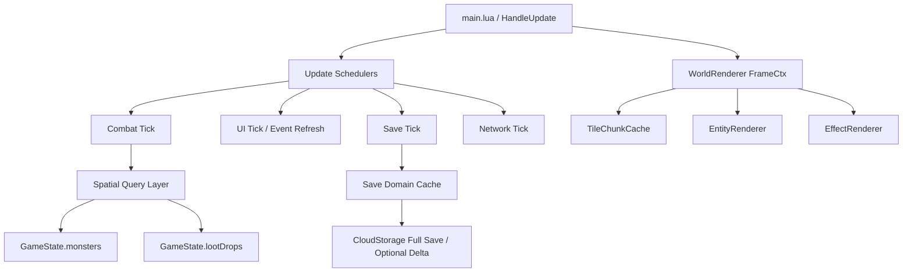

# 性能优化改动方案（代码基准版）

> 文档时间：2026-05-07
>
> 适用范围：`rengouxiantu-docs/scripts/` 当前运行中的客户端、存档、联机同步实现
>
> 参考文档：`docs/战斗系统架构优化方案-代码基准版.md`
>
> 结论原则：以代码为准，设计文档、历史评估与经验判断仅作为辅助参考

---

## 1. 文档目的

本文档用于给当前项目提供一份可执行的性能优化改动方案。目标不是一次性重写系统，而是在不破坏现有战斗、掉落、UI、存档与联机行为的前提下，先解决最明确的热点路径，再逐步建立可持续的性能基线、灰度能力和回归护栏。

本文档遵循和《战斗系统架构优化方案（代码基准版）》相同的方法：先以代码里的真实执行路径为基准，确认瓶颈所在，再设计分阶段的低风险改造路径，而不是先做抽象层面的“理想优化”。

---

## 2. 代码基准与事实来源

本方案主要基于以下代码交叉得出：

- `scripts/main.lua`
- `scripts/core/GameState.lua`
- `scripts/core/EventBus.lua`
- `scripts/entities/Monster.lua`
- `scripts/systems/SkillSystem.lua`
- `scripts/systems/LootSystem.lua`
- `scripts/rendering/WorldRenderer.lua`
- `scripts/rendering/TileRenderer.lua`
- `scripts/rendering/EntityRenderer.lua`
- `scripts/rendering/EffectRenderer.lua`
- `scripts/ui/BottomBar.lua`
- `scripts/ui/Minimap.lua`
- `scripts/ui/DPSTracker.lua`
- `scripts/systems/SaveSystem.lua`
- `scripts/systems/save/SaveState.lua`
- `scripts/systems/save/SavePersistence.lua`
- `scripts/systems/save/SaveLoader.lua`
- `scripts/network/CloudStorage.lua`
- `scripts/network/DungeonClient.lua`
- `scripts/server_main.lua`

辅助参考文档：

- `docs/战斗系统架构优化方案-代码基准版.md`
- `docs/架构文档/第二轮独立评估报告.md`
- `docs/归档/综合优化评估报告.md`

---

## 3. 当前性能架构现状

### 3.1 主循环与调度

当前性能成本首先集中在 `scripts/main.lua` 的主循环里。`HandleUpdate()` 每帧串行推进多个系统，包含：

- `CloudStorage.Tick()` 等网络和存档相关低频逻辑
- `Monster` 全量更新
- `BottomBar.Update(uiRoot_)`
- `Minimap.UpdateQuest()`
- `DPSTracker.Update(dt)`

这意味着项目当前仍是“单帧串行推进 + 多系统共用同一节奏”的结构。战斗相关、UI 相关、统计相关、网络相关的逻辑虽然内部有节流，但调度入口没有做明显分层。

### 3.2 查询层

`scripts/core/GameState.lua` 仍承担怪物表、掉落表等全局容器职责。当前关键查询包括：

- `GetMonstersInRange()`
- `GetNearestMonster()`

它们都直接遍历 `GameState.monsters`，属于典型的 `O(n)` 范围查询。

`scripts/systems/SkillSystem.lua` 在主动技能、被动触发、剑阵等路径内多次调用 `GetMonstersInRange()`，因此“查询层线性扫描”会被放大成“战斗层重复线性扫描”。

### 3.3 渲染层

渲染主调度位于 `scripts/rendering/WorldRenderer.lua`。当前路径是：

- `WorldRenderer:Render()` 调度瓦片、实体、特效渲染
- `RenderTiles()` 每帧逐 tile 调用 `TileRenderer:RenderTile()`
- `RenderZoneTransitions()` 对可视区再做一遍过渡扫描
- `EntityRenderer` 和 `EffectRenderer` 内部再次做可见性判断、世界坐标转屏幕坐标、遍历不同实体表

这说明渲染层已有模块拆分，但帧级上下文没有统一缓存，静态内容也没有真正做块级预烘焙。

### 3.4 UI 层

UI 目前已有局部限频，但大部分刷新还是“轮询 + 全量改文本/样式”的模式：

- `scripts/ui/BottomBar.lua` 会高频 `FindById()`、`SetText()`、`SetStyle()`
- `scripts/ui/Minimap.lua` 的任务和日常信息通过主循环固定刷新
- `scripts/ui/DPSTracker.lua` 每次更新会维护近期伤害列表，并在过期数据清理上使用线性移除

当前 UI 的主要问题不是“没有节流”，而是“节流后的每次刷新仍然过重”。

### 3.5 存档与在线同步层

当前存档链路仍然是全量装配与全量上传：

- `scripts/systems/SaveState.lua` 当前 `CURRENT_SAVE_VERSION = 19`
- 自动存档间隔 `AUTO_SAVE_INTERVAL = 60`
- 防抖间隔 `SAVE_DEBOUNCE_INTERVAL = 3`
- `scripts/systems/save/SavePersistence.lua` 在 `DoSave()` 中重新装配多个域并序列化
- `scripts/network/CloudStorage.lua` 仍将 `coreData` 做整包 JSON 编码后发送
- 服务端 `scripts/server_main.lua` 的 `HandleSaveGame()` 仍按整包存档做解析、修正与落盘

这说明当前存档热点并不只在“磁盘或网络”，更在“序列化装配本身 + 每次都做完整负载”。

---

## 4. 当前主要性能问题

### 4.1 核心问题不是单点慢，而是热点路径叠加

当前最影响帧时间的，不是某一个特别重的函数，而是以下几类热点在同一帧内反复叠加：

- 查询层的重复 `O(n)` 扫描
- 渲染层的重复可见性判断和静态内容重绘
- UI 层的差量能力不足
- 存档层的全域重算、全域序列化

### 4.2 主循环把不同成本模型的系统绑在一起

战斗、UI、统计、任务文本、网络心跳的最佳刷新频率并不相同，但当前都挂在 `HandleUpdate()` 主循环上。这种结构的结果不是“每个系统都重”，而是“系统之间互相抢帧预算”。

### 4.3 查询层没有空间索引

只要怪物数、掉落数、技能范围查询次数叠加上来，`GameState` 的线性扫描就会直接进入主热点。当前项目已经有明显的“范围查询多于实体增删次数”的特征，适合引入空间分桶或 spatial hash。

### 4.4 渲染层重复计算过多

当前渲染存在三个直接问题：

- 可视范围、坐标转换没有统一帧缓存
- 静态瓦片每帧仍在程序化绘制
- 地表过渡层与实体层分别扫描，没有共享上下文

### 4.5 UI 刷新模型偏轮询

`BottomBar`、`Minimap`、`DPSTracker` 当前都不是“只在状态变化时刷新”，而是“到了刷新时机就做一轮完整刷新”。这类成本在单次上不一定高，但累计非常稳定，会长期占据帧预算。

### 4.6 存档优化不能直接跳到协议重写

当前存档加载端同时兼容旧格式和 v11 之后的单键格式，服务端也有权威修正逻辑。因此如果一上来就做存档 schema 或协议改造，风险会明显高于收益。正确顺序应该是：

1. 先优化运行时装配和序列化缓存
2. 再决定是否值得单独推进协议差量化

---

## 5. 优化目标与非目标

### 5.1 本轮优化目标

- 降低主循环 p95 帧耗时
- 降低范围查询总扫描量
- 降低渲染层重复计算与静态重绘成本
- 降低 UI 高频刷新中的无效更新比例
- 降低单次自动存档 CPU 时间和 payload 大小
- 建立功能开关、对照日志和回滚路径

### 5.2 本轮明确非目标

- 不在第一阶段重写战斗数值系统
- 不在第一阶段修改存档持久化格式
- 不在第一阶段修改 `CURRENT_SAVE_VERSION`
- 不在第一阶段修改服务端存档协议
- 不在第一阶段降低核心战斗 tick 频率

---

## 6. 优化原则

### 6.1 先建观测，再做替换

所有高风险优化都必须先补充耗时、调用次数、数据量统计，否则优化效果无法证明，回退条件也不清楚。

### 6.2 优先替换内部实现，不先改对外接口

例如 `GameState.GetMonstersInRange()` 的签名在第一阶段不动，只替换内部实现。这样可以让调用层先受益，避免同时引入接口迁移风险。

### 6.3 先做“兼容型增量改造”，再考虑“结构型大改”

例如：

- 查询层先引入空间索引，但保留 `GameState.monsters`
- 存档层先引入脏域缓存，但保留完整 `coreData`
- 渲染层先增加 `frameCtx`，而不是立刻重写所有 renderer

### 6.4 每个高风险能力都必须有开关和回退

推荐统一在 `scripts/config/GameConfig.lua` 或单独配置模块中增加 `PERF_FLAGS`，用于灰度、A/B、线上紧急回退。

---

## 7. 目标性能架构

### 7.1 目标结构



### 7.2 关键思路

- 主循环保留统一入口，但内部按职责拆成不同频率的调度器
- 查询层引入空间索引，减少战斗逻辑的重复线性扫描
- 渲染层建立帧级上下文缓存，静态地表块级缓存
- UI 从“定时全量刷新”转向“差量刷新 + 事件驱动”
- 存档从“每次重算所有域”转向“脏域缓存 + 周期性全量兜底”

---

## 8. 关键改动方案

### 8.1 查询层：引入 `SpatialIndex`

#### 改动目标

降低怪物和掉落查询的总扫描量，优先解决 `GetMonstersInRange()`、`GetNearestMonster()` 和掉落拾取半径扫描热点。

#### 建议改动

- 新增 `scripts/core/SpatialIndex.lua`
- 在 `scripts/core/GameState.lua` 内增加：
  - `monsterIndex`
  - `lootIndex`
  - `SyncMonsterCell(monster, oldX, oldY)`
  - `SyncLootCell(drop, oldX, oldY)`
  - `RemoveMonsterFromIndex(monster)`
  - `RemoveLootFromIndex(drop)`
- 保留 `GameState.monsters`、`GameState.lootDrops` 作为兼容层与渲染层数据源
- `GetMonstersInRange()` 和 `GetNearestMonster()` 保持原签名，但改为：
  - 按格子收集候选
  - 再做精确距离过滤
  - 在需要稳定顺序的路径上追加稳定排序

#### 关联改动文件

| 文件 | 计划改动 |
|---|---|
| `scripts/core/SpatialIndex.lua` | 新增空间分桶实现 |
| `scripts/core/GameState.lua` | 挂接索引、查询替换、增删同步 |
| `scripts/entities/Monster.lua` | 在移动、死亡、移除时同步索引 |
| `scripts/systems/LootSystem.lua` | 自动拾取、过期清理走附近查询 |
| `scripts/systems/SkillSystem.lua` | 高频技能范围查询受益 |

#### 关键约束

- 第一阶段不改变怪物与掉落的主存储表结构
- 第一阶段不允许通过空间索引改变技能目标选择的外部语义
- 如果目标选择存在稳定顺序需求，必须显式补排序规则

#### 推荐排序规则

- `player.target` 优先
- `distanceSq` 升序
- `spawnSeq` 升序

这样可以避免“引入索引后命中集合一样，但命中顺序漂移”的问题。

---

### 8.2 战斗调用层：统一技能目标获取

#### 改动目标

把 `SkillSystem` 中分散的范围查询、扇形过滤、数量截断、排序逻辑收敛到一个统一入口，避免每个技能类型自行做一遍候选筛选。

#### 建议改动

在 `scripts/systems/SkillSystem.lua` 中新增统一入口，例如：

- `AcquireTargets(player, skill, cx, cy, targetAngle, opts)`

职责统一为：

- 调用 `GameState.GetMonstersInRange()`
- 按技能形状过滤
- 保留主目标优先级
- 统一排序
- 截断 `maxTargets`

#### 收益

- 查询层替换后，技能系统可以统一受益
- 后续测试可以直接围绕 `AcquireTargets()` 建回归
- 降低技能类型分支里重复的查询和排序逻辑

---

### 8.3 渲染层：引入 `RenderFrameContext`

#### 改动目标

减少一帧内的重复可见性判断、坐标转换和多表遍历。

#### 建议改动

在 `scripts/rendering/WorldRenderer.lua` 内新增帧级上下文构建函数，例如：

- `BuildFrameContext(camera, player, worldState)`

`frameCtx` 至少包含：

- `tileSize`
- 可见世界边界
- 可见 tile 范围
- 可见怪物列表
- 可见掉落列表
- 可见 NPC 列表
- 常用世界坐标到本地坐标缓存

之后让：

- `EntityRenderer`
- `EffectRenderer`
- `TileRenderer`

优先消费 `frameCtx`，减少各自内部重复扫描和重复计算。

#### 关联改动文件

| 文件 | 计划改动 |
|---|---|
| `scripts/rendering/WorldRenderer.lua` | 生成并传递 `frameCtx` |
| `scripts/rendering/EntityRenderer.lua` | 改为消费可见实体与坐标缓存 |
| `scripts/rendering/EffectRenderer.lua` | 复用可见区与坐标缓存 |

#### 风险控制

- 第一阶段不要同时改视觉样式和性能路径
- 所有 `frameCtx` 缓存都只允许“帧内有效”，不能跨帧持久化可见结果

---

### 8.4 地表层：引入 `TileChunkCache`

#### 改动目标

避免每帧程序化重绘静态瓦片和过渡层。

#### 建议改动

- 新增 `TileChunkCache`，按 `16x16` 或 `32x32` tile 为单位缓存静态地表
- 把普通地表和 zone transition 一并烘进 chunk
- 保留动态特效、实体、受击反馈在现有路径绘制

#### 推荐失效入口

- `TileRenderer.ResetCache()`
- 章节切换
- `RebuildWorld()`
- 副本快照进入/退出
- 封印解除或地表状态切换

#### 关联改动文件

| 文件 | 计划改动 |
|---|---|
| `scripts/rendering/TileRenderer.lua` | chunk 渲染与失效管理 |
| `scripts/rendering/WorldRenderer.lua` | 切换为按 chunk 调度静态层 |

#### 关键约束

- 不允许让 chunk 缓存直接持有动态实体状态
- 所有世界状态变更必须汇总到统一失效入口，不能靠调用方自行“顺便重置”

---

### 8.5 UI 层：差量刷新与事件驱动

#### `BottomBar`

##### 改动目标

把“定时全量刷控件”改成“缓存引用 + 仅在值变化时更新”。

##### 建议改动

- 创建期缓存控件引用，避免每次 `FindById()`
- 建立 `lastViewState`
- 仅在文本或样式实际变更时调用 `SetText()` / `SetStyle()`
- 技能按钮只在以下情况刷新：
  - 冷却数值变化
  - 装备变化
  - 技能配置变化

#### `Minimap`

##### 改动目标

把任务、日常信息从主循环固定刷新改为事件驱动。

##### 建议改动

- `UpdateQuest()` 由 `quest_progress_changed`、`chapter_changed` 等事件触发
- `UpdateDaily()` 由 `daily_reset`、奖励领取等事件触发
- 渲染层拆成：
  - 静态底图
  - 动态标记层

#### `DPSTracker`

##### 改动目标

降低近期伤害窗口维护的线性成本。

##### 建议改动

- 把 `recentDamage_` 从“头删数组”改为 ring buffer 或 head index
- 维护 `recentSum`
- UI 展示按 10fps 左右刷新即可

#### 关联改动文件

| 文件 | 计划改动 |
|---|---|
| `scripts/ui/BottomBar.lua` | 缓存节点引用、差量文本样式更新 |
| `scripts/ui/Minimap.lua` | 事件驱动刷新、静态底图与动态层拆分 |
| `scripts/ui/DPSTracker.lua` | ring buffer、低频 UI 更新 |
| `scripts/main.lua` | 删除不必要的固定轮询调用 |

---

### 8.6 存档层：引入 `Save Domain Cache`

#### 改动目标

在不改变存档结构与网络协议的前提下，降低每次自动存档的装配与序列化成本。

#### 第一阶段建议

第一阶段只优化运行时，不改持久化 schema：

- 保持 `CURRENT_SAVE_VERSION = 19`
- 保持 `CloudStorage` 整包上传 `coreData`
- 保持 `SaveLoader` 的旧格式兼容逻辑
- 保持服务端 `HandleSaveGame()` 解析入口不变

#### 建议改动

在 `scripts/systems/save/SaveState.lua` 增加：

- `dirtyDomains`
- `coreDataCache`
- `serializedCache`
- `lastFullSaveAt`

在 `scripts/systems/save/SavePersistence.lua` 中：

- 按域拆分序列化函数
- 仅重算脏域
- 重新拼装 `coreData`
- 每 `CHECKPOINT_INTERVAL` 次强制做一次全量保存
- 手动保存、退出保存、切角色保存强制全量

#### 推荐域划分

- `player`
- `inventory`
- `quests`
- `collection`
- `bulletin`
- `eventData`

#### 关键约束

- 第一阶段不修改最终 `coreData` 结构
- 第一阶段不新增服务端 merge 语义
- 第一阶段必须保留“全量保存兜底”

---

### 8.7 在线同步：位置发送差量化

#### 改动目标

在不改变联机协议形态的前提下，减少无意义的位置包发送。

#### 建议改动

在 `scripts/network/DungeonClient.lua` 中保留 10fps 发送上限，但加入更细的发送条件：

- 位置变化超过 `epsilon`
- 朝向变化
- 动画状态变化

如果以上都未变，则跳过本次发送。

#### 关键约束

- 不修改快照接收与回放逻辑
- 不修改副本权威同步语义
- 不把这个优化和战斗判定频率调整绑定在一起

---

### 8.8 配置层：统一 `PERF_FLAGS`

#### 改动目标

确保所有高风险优化都支持灰度、对照和快速回退。

#### 建议配置项

```lua
PERF_FLAGS = {
    spatialQuery = false,
    renderFrameContext = false,
    tileChunkCache = false,
    uiDiffRefresh = false,
    saveDomainCache = false,
    dungeonPositionEpsilon = false,
    dualQueryValidation = false,
    saveFullSnapshotValidation = false,
}
```

#### 使用原则

- 新能力先关后开
- 灰度期间允许双算对照
- 线上紧急回退只关开关，不走热修复重构

### 8.9 按文件改动清单

| 文件 | 改动类型 | 计划改动 | 所属阶段 |
|---|---|---|---|
| `scripts/config/GameConfig.lua` | 修改 | 增加 `PERF_FLAGS`、性能统计开关、阈值配置 | Phase 0 |
| `scripts/main.lua` | 修改 | 给 `HandleUpdate()` 做分段耗时埋点；把 UI、统计、任务刷新从统一轮询改成分层调度 | Phase 0-1 |
| `scripts/core/SpatialIndex.lua` | 新增 | 实现空间分桶或 spatial hash，提供插入、移除、移动同步、范围查询 | Phase 2 |
| `scripts/core/GameState.lua` | 修改 | 挂接 `monsterIndex`、`lootIndex`，替换 `GetMonstersInRange()`、`GetNearestMonster()` 内部实现，保留原接口 | Phase 2 |
| `scripts/entities/Monster.lua` | 修改 | 怪物移动、死亡、移除时同步空间索引；必要时补 `spawnSeq` | Phase 2 |
| `scripts/systems/LootSystem.lua` | 修改 | 自动拾取和掉落过期清理改用附近查询；维护掉落索引 | Phase 2 |
| `scripts/systems/SkillSystem.lua` | 修改 | 新增统一目标选择入口 `AcquireTargets()`，收敛范围筛选、排序、截断 | Phase 2 |
| `scripts/rendering/WorldRenderer.lua` | 修改 | 新增 `frameCtx` 构建逻辑；整合静态层、实体层、特效层的可见区上下文 | Phase 3 |
| `scripts/rendering/TileRenderer.lua` | 修改 | 新增 `TileChunkCache`、chunk 构建与统一失效入口 | Phase 3 |
| `scripts/rendering/EntityRenderer.lua` | 修改 | 使用 `frameCtx` 的可见实体和坐标缓存，减少重复 `IsVisible` 与坐标转换 | Phase 3 |
| `scripts/rendering/EffectRenderer.lua` | 修改 | 复用 `frameCtx` 的可见范围与坐标缓存 | Phase 3 |
| `scripts/ui/BottomBar.lua` | 修改 | 缓存节点引用、引入 `lastViewState`、只在值变化时刷新文本和样式 | Phase 1 |
| `scripts/ui/Minimap.lua` | 修改 | 任务/日常信息改事件驱动；拆静态底图与动态标记层 | Phase 1-3 |
| `scripts/ui/DPSTracker.lua` | 修改 | 把近期伤害窗口改为 ring buffer 或 head index，降低头删成本 | Phase 1 |
| `scripts/systems/SaveState.lua` | 修改 | 增加 `dirtyDomains`、`coreDataCache`、`serializedCache`、全量保存兜底状态 | Phase 4 |
| `scripts/systems/save/SavePersistence.lua` | 修改 | 按域序列化、脏域重算、周期性全量保存、开发态新旧结果对照 | Phase 4 |
| `scripts/systems/save/SaveLoader.lua` | 默认不改 | 第一阶段不改加载格式；如 Phase 5 改协议/版本，再单独补兼容 | Phase 4 之前不动 |
| `scripts/network/CloudStorage.lua` | 修改 | 第一阶段保留整包上传，仅接入缓存后的 `coreData`；Phase 5 可选扩展 delta save | Phase 4-5 |
| `scripts/network/DungeonClient.lua` | 修改 | 保留 10fps 上限，加入位置/朝向/动画状态差量发送条件 | Phase 1 |
| `scripts/server_main.lua` | 默认不改 | Phase 4 前不改；如引入 `C2S_SaveGameDelta` 再单独扩展服务端 merge | Phase 5 |
| `scripts/core/EventBus.lua` | 可选修改 | 若前述优化完成后仍有明显热事件开销，再评估降低 `Emit()` 快照复制成本 | 可选尾项 |
| `scripts/tests/test_spatial_index.lua` | 新增 | 空间索引与旧查询结果对照测试 | Phase 2 |
| `scripts/tests/test_skill_target_selection.lua` | 新增 | 技能目标选择一致性与排序稳定性测试 | Phase 2 |
| `scripts/tests/test_tile_chunk_cache.lua` | 新增 | 静态地表缓存命中与失效测试 | Phase 3 |
| `scripts/tests/test_save_dirty_cache.lua` | 新增 | 脏域缓存与全量序列化结果一致性测试 | Phase 4 |
| `scripts/tests/test_save_roundtrip_v10_v11_v19.lua` | 新增 | 历史存档 round-trip 兼容测试 | Phase 4 |

---

## 9. 风险评估

### 9.1 线上风险

| 风险项 | 具体表现 | 风险等级 | 控制方式 |
|---|---|---|---|
| 空间索引同步遗漏 | 怪物在画面里但技能打不到，或掉落捡不到 | 高 | 双轨校验、开发期与灰度期保留暴力查询对照 |
| 技能目标顺序漂移 | 同样的技能命中对象变化，影响手感或收益 | 高 | 统一排序规则，建立目标选择回归测试 |
| 帧缓存污染 | 实体坐标、可见结果跨帧复用导致显示错乱 | 中 | `frameCtx` 仅帧内有效，不做跨帧持久化 |
| chunk 失效不全 | 章节切换或副本退出后地表残留旧图层 | 高 | 统一失效入口，不允许调用方私自维护缓存 |
| UI 差量刷新漏更新 | 数值已变化但界面不刷新 | 中 | 开发态增加 diff 日志和强制全量刷新回退开关 |
| 联机位置节流过度 | 其他玩家移动表现卡顿 | 中 | 仅减“无变化包”，不降低原有最大发送频率 |

### 9.2 存档风险

| 风险项 | 具体表现 | 风险等级 | 控制方式 |
|---|---|---|---|
| 脏域标记遗漏 | 游戏内状态已变化，但自动存档没写入 | 高 | 周期性全量保存、关键场景强制全量 |
| 缓存拼装错误 | `coreData` 内容不完整或域被覆盖 | 高 | 新旧序列化结果对比校验，开发态强检查 |
| 提前改 schema | 旧档兼容失效或服务端落盘异常 | 极高 | 第一阶段明确禁止改 schema、版本号和协议 |
| delta save merge 错误 | 服务端把未发送域覆盖为空 | 极高 | 作为独立阶段单独设计、单独发版 |

### 9.3 为什么第一阶段不能碰存档版本

当前 `SaveLoader` 同时承担：

- 旧多键格式兼容
- v11 之后单键格式重组
- 运行态还原

服务端又承担：

- `coreData` 解码
- 合法性修正
- 数据裁剪

因此存档 schema 变更的风险远高于查询和渲染优化。第一阶段如果同时改 schema，会把“性能问题”升级成“线上数据安全问题”。

---

## 10. 执行路径

### 10.1 Phase 0：观测与开关

#### 目标

建立基线，确认优化是否有效，给后续所有阶段准备灰度能力。

#### 建议改动

- 在 `main.lua` 增加分段耗时统计
- 统计以下指标：
  - `HandleUpdate` p50 / p95 / max
  - `GetMonstersInRange()` 调用次数
  - 每帧可见 tile 数
  - UI `SetText()` / `SetStyle()` 次数
  - 单次 `DoSave()` 耗时
  - `coreData` JSON 字节数
- 引入 `PERF_FLAGS`

#### 发布建议

- 可以直接上线
- 不改变游戏行为

### 10.2 Phase 1：低风险热点先行

#### 目标

先吃掉不影响核心战斗语义的固定成本。

#### 建议范围

- `BottomBar` 差量刷新
- `Minimap` 任务/日常事件驱动
- `DPSTracker` ring buffer
- `DungeonClient` 位置差量发送

#### 发布建议

- 单独发版
- 灰度期关注 UI 漏刷和联机移动表现

### 10.3 Phase 2：空间索引上线

#### 目标

解决战斗和掉落的查询层热点。

#### 建议范围

- 新增 `SpatialIndex`
- `GameState` 接入索引
- `Monster`、`LootSystem` 同步索引
- `SkillSystem` 收敛目标获取

#### 发布建议

- 必须有 `dualQueryValidation`
- 优先单机场景打开，再逐步覆盖多人副本

### 10.4 Phase 3：渲染层缓存化

#### 目标

降低静态地表绘制和重复计算成本。

#### 建议范围

- `RenderFrameContext`
- `TileChunkCache`
- `EntityRenderer` / `EffectRenderer` 消费 `frameCtx`

#### 发布建议

- 先只覆盖主地图
- 副本、特殊地表、封印门等高变化区域逐步纳入

### 10.5 Phase 4：存档运行时缓存

#### 目标

在不改存档结构的前提下降低自动存档耗时。

#### 建议范围

- `Save Domain Cache`
- 周期性全量保存兜底
- 新旧序列化结果对照

#### 发布建议

- 必须带 `saveFullSnapshotValidation`
- 手动存档、退出存档强制全量

### 10.6 Phase 5：可选的协议级优化

#### 目标

如果 Phase 4 后存档 CPU 或 payload 仍不满足目标，再推进协议差量化。

#### 建议范围

- 新增 `C2S_SaveGameDelta`
- 服务端显式按域 merge
- 版本握手与降级逻辑
- 视情况升级 `CURRENT_SAVE_VERSION`

#### 发布建议

- 必须独立立项
- 不能与查询、渲染、UI 改动混发

---

## 11. 测试方案

### 11.1 单元与组件测试

建议新增：

- `scripts/tests/test_spatial_index.lua`
- `scripts/tests/test_skill_target_selection.lua`
- `scripts/tests/test_tile_chunk_cache.lua`
- `scripts/tests/test_save_dirty_cache.lua`
- `scripts/tests/test_save_roundtrip_v10_v11_v19.lua`

建议覆盖：

- 怪物随机移动、增删、范围查询结果与旧实现一致
- 技能主目标优先、扇形过滤、数量截断结果一致
- chunk 缓存的构建、命中、失效逻辑正确
- 脏域缓存和旧全量序列化的最终 `coreData` 一致
- 旧存档、v11 存档、v19 存档的 round-trip 一致

### 11.2 回归测试

建议扩展现有回归套件，覆盖以下对照场景：

- `PERF_FLAGS.spatialQuery = false/true` 结果一致
- `PERF_FLAGS.saveDomainCache = false/true` 存档数据一致
- `PERF_FLAGS.uiDiffRefresh = false/true` UI 展示一致
- `PERF_FLAGS.tileChunkCache = false/true` 视觉结果一致

### 11.3 性能基准测试

建议建立固定压测场景：

- 同屏怪物数：`30 / 60 / 120`
- 掉落数：`20 / 50 / 100`
- 背包容量：满 60 格
- 连续运行：10 分钟自动存档循环

记录指标：

- `HandleUpdate` p50 / p95 / max
- `GetMonstersInRange()` 每秒调用次数
- 单帧可见实体数
- UI 变更调用次数
- 单次 `DoSave()` 耗时
- `coreData` payload 字节数

### 11.4 联机回归

联机部分至少覆盖：

- 双客户端移动同步
- 副本进出
- 断线重连
- 奖励领取
- 切章节后再存档

验证点：

- idle 时不发无意义位置包
- 移动时仍保持原有流畅度
- 快照同步不因位置节流产生错位

### 11.5 灰度与回滚测试

每个高风险阶段都必须验证：

- 开关开启时路径正常
- 开关关闭时可立即回退到旧逻辑
- 回退后不依赖额外数据迁移

---

## 12. 优先级建议

### 第一优先级

- `BottomBar` 差量刷新
- `Minimap` 事件驱动
- `DPSTracker` ring buffer
- `SpatialIndex`

原因是这些改动收益明确、边界清晰、可灰度，且不会直接触碰存档兼容。

### 第二优先级

- `RenderFrameContext`
- `TileChunkCache`

原因是渲染收益高，但视觉回归面更广，适合在查询层稳定后推进。

### 第三优先级

- `Save Domain Cache`

原因是收益明确，但数据安全优先级高于性能收益，必须在前两类优化稳定后推进。

### 最后推进

- `C2S_SaveGameDelta`
- 存档 schema 调整
- 存档版本升级

这些不是不能做，而是不适合和前面的性能改造混成一次上线。

---

## 13. 最终建议

当前项目最值得优先解决的性能问题，不是“继续在各处做细碎缓存”，而是先把几个结构性热点拆掉：

1. 把查询层的线性扫描换掉
2. 把渲染层的帧级重复计算和静态重绘拆掉
3. 把 UI 从定时全量刷新改成差量刷新
4. 把存档从全域重算改成脏域缓存，但暂时不要碰 schema 和协议

如果要落地成实际排期，建议顺序为：

1. `PERF_FLAGS + 观测埋点`
2. `BottomBar / Minimap / DPSTracker / DungeonClient`
3. `SpatialIndex + SkillSystem 目标收敛`
4. `RenderFrameContext + TileChunkCache`
5. `Save Domain Cache`
6. 视效果决定是否单独推进 `SaveGameDelta`

这条路径的关键不是“理论上最优”，而是“能上线、能灰度、能回退、不会碰坏存档”。

---

## 14. Phase 1 执行记录与风险审计

> 执行时间：2026-05-07
> 审计时间：2026-05-07
> 构建验证：通过（entry_client=client_main.lua, entry_server=server_main.lua）

### 14.1 实际执行的 Phase 1 范围

Phase 1 实际执行的是**热路径 local 化**（math 全局表查找消除 + inline require 提升），而非文档 §10.2 规划的 UI 差量刷新。这是因为 local 化属于零语义变更的纯机械优化，风险最低，适合作为第一批改动。

#### 变更文件清单

| 文件 | 变更类型 | 具体改动 |
|------|---------|---------|
| `systems/CombatSystem.lua` | math local化 × 10 + require 提升 | 新增 `local ArtifactSystem = require(...)` 到模块顶层；新增 10 个 `local math_* = math.*`；移除 AutoAttack 内部的 inline `require("systems.ArtifactSystem")`；全文替换 `math.*()` → `math_*()` |
| `systems/SkillSystem.lua` | math local化 × 10 | 新增 10 个 `local math_* = math.*`（含 `math_rad`）；全文约 60 处 `math.*()` → `math_*()` 替换 |
| `systems/combat/SetAoeSystem.lua` | math local化 × 2 | 新增 `local math_floor` 和 `local math_random`；2 处调用替换 |
| `entities/Monster.lua` | math local化 × 7 + require 提升 + Utils local化 | 新增 `local CombatSystem = require(...)` 和 `local GameState = require(...)` 到模块顶层；新增 7 个 `local math_*` + `local DistanceSq = Utils.DistanceSq`；移除 TakeDamage 内部的 inline require；9 处 `Utils.DistanceSq()` → `DistanceSq()` 替换 |

### 14.2 风险审计结论

#### 风险 1：循环依赖链 ⚠️ 中等风险

**发现链条：**

```
Monster.lua ──require──> CombatSystem.lua ──require──> ArtifactSystem.lua
                                                           │ (inline require)
                                                           ├── entities.Monster
                                                           └── systems.CombatSystem
```

**当前状态：安全。** ArtifactSystem 内部对 Monster 和 CombatSystem 的 require 是 lazy-loaded（在 `EnterBossArena`、`ExitBossArena`、`UpdateBossArena` 等函数体内），运行时 `package.loaded` 已有缓存，不会触发循环加载。

**加载顺序验证：**

1. Monster.lua 开始加载
2. 第 11 行触发 `require("systems.CombatSystem")`
3. CombatSystem.lua 开始加载
4. 第 9 行触发 `require("systems.ArtifactSystem")`
5. ArtifactSystem.lua 加载完成（模块顶层无反向 require）✅
6. CombatSystem.lua 加载完成 ✅
7. Monster.lua 加载完成 ✅
8. 运行时：ArtifactSystem 函数内的 `require("entities.Monster")` 命中缓存 ✅

**风险点：** 如果未来有人将 ArtifactSystem 中的 inline require 移到模块顶层，会导致 require 死循环。此隐患**未在代码中文档化**。

**建议行动：** 在 ArtifactSystem.lua 的 inline require 处添加注释说明 lazy-load 原因。

#### 风险 2：math_pi 自引用 Bug ✅ 已修复

上一轮 `replace_all` 将 `local math_pi = math.pi` 的右侧也替换为 `math_pi`，造成 `local math_pi = math_pi`（nil 自引用）。

**审计结果：** 4 个文件的所有定义行均已修正为 `local math_pi = math.pi`，无残留。

#### 风险 3：`local CS = CombatSystem` 语义变化 ✅ 无风险

Monster.lua TakeDamage 中原为 `local CS = require("systems.CombatSystem")`（查 package.loaded 缓存），现为 `local CS = CombatSystem`（模块级 upvalue）。两者指向同一个 table 引用，`CS.activeZones` 等运行时字段有 nil 守卫（`if CS.activeZones then`），等价替换。

#### 风险 4：SetAoeSystem Pattern A 结构 ✅ 无风险

local aliases 位于 `return function(CS)` 之前的模块作用域，`math_floor` 和 `math_random` 作为 upvalue 被闭包内函数正确捕获。结构完整。

#### 风险 5：GameState require 提升 ✅ 无风险

`GameState` 是纯数据容器，不依赖 Monster。Monster 加载时 GameState 已在 `package.loaded` 中。

#### 风险 6：DistanceSq local化 ✅ 无风险

`local DistanceSq = Utils.DistanceSq` 在模块加载时取函数引用，此时 `Utils` 已 require 完毕。9 处调用全部替换，grep 确认无遗漏。

#### 风险 7：replace_all 误伤 ✅ 无风险

- 无 `math.pi` 出现在字符串文本中
- 所有 `math.*()` 调用参数形式均已正确替换
- 无同名局部变量冲突

### 14.3 综合评定

| 风险项 | 严重度 | 状态 | 是否需要行动 |
|--------|--------|------|-------------|
| 循环依赖链（ArtifactSystem inline require） | ⚠️ 中 | 当前安全 | 建议加注释文档化 |
| math_pi 自引用 | 🟢 已修复 | 无残留 | 无 |
| CombatSystem 引用语义 | 🟢 无风险 | 等价替换 | 无 |
| SetAoeSystem Pattern A | 🟢 无风险 | 结构正确 | 无 |
| GameState require 提升 | 🟢 无风险 | 无反向依赖 | 无 |
| DistanceSq local化 | 🟢 无风险 | 引用一致 | 无 |
| replace_all 误伤 | 🟢 无风险 | grep 验证通过 | 无 |

**结论：Phase 1 local 化变更安全，可以上线。唯一待办是在 ArtifactSystem.lua 的 inline require 处补充注释，防止后续维护者误操作。**
