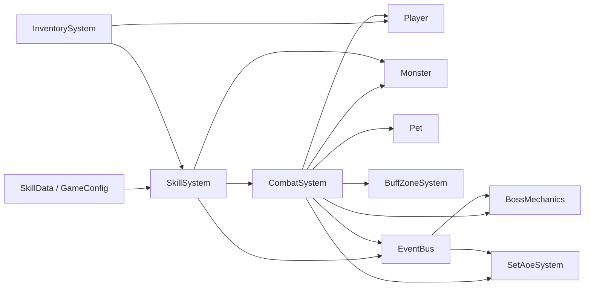
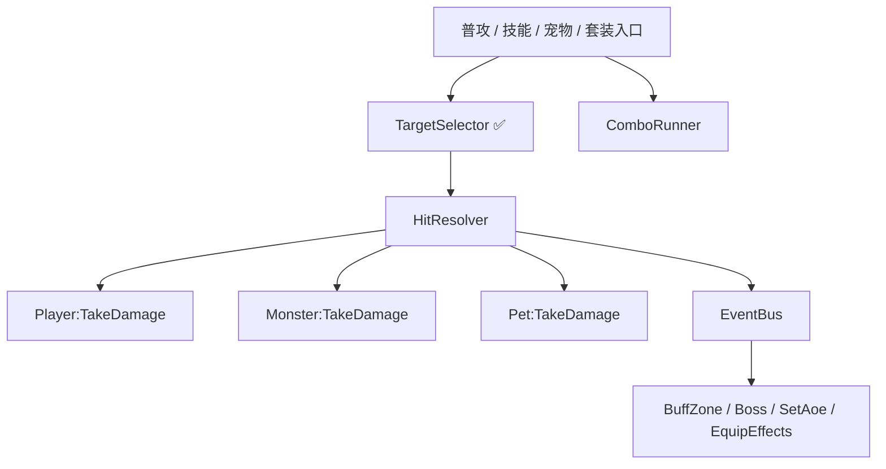

# 战斗系统架构优化方案（代码基准版）

> 文档时间：2026-05-05
> 
> 最后更新：2026-05-06（Step 1/2 已完成，附录同步更新）
> 
> 适用范围：`rengouxiantu-docs/scripts/` 当前战斗实现
> 
> 结论原则：以代码为准，设计文档与历史评估仅作为辅助参考

---

## 1. 文档目的

本文档用于给当前项目的战斗系统提供一份可执行的架构优化方案，目标不是重写战斗，而是在不破坏现有职业、装备、套装、法宝、宠物、Boss 机制的前提下，降低重复逻辑、明确模块边界、补齐测试护栏，并为后续新增职业与战斗机制提供稳定底座。

本文档不以历史设计描述为主，而以当前代码实现为主。所有结论都优先服从运行中的实际逻辑。

---

## 2. 代码基准与事实来源

本方案主要基于以下代码与文档交叉得出：

- `scripts/systems/CombatSystem.lua`
- `scripts/systems/SkillSystem.lua`
- `scripts/entities/Player.lua`
- `scripts/entities/Monster.lua`
- `scripts/entities/Pet.lua`
- `scripts/systems/combat/BuffZoneSystem.lua`
- `scripts/systems/combat/BossMechanics.lua`
- `scripts/systems/combat/SetAoeSystem.lua`
- `scripts/systems/InventorySystem.lua`
- `scripts/config/GameConfig.lua`
- `scripts/config/SkillData.lua`
- `scripts/tests/test_p1_regression.lua`
- `scripts/tests/test_pre_damage_hooks.lua`

**优化过程中新增的文件**（Step 1/2 产出）：

- `scripts/systems/combat/BattleContracts.lua` — HitContext / HitResult 契约定义
- `scripts/systems/combat/TargetSelector.lua` — 统一目标选择器
- `scripts/tests/test_battle_pipeline_regression.lua` — 战斗管线回归测试（96 断言）
- `scripts/tests/test_target_selector.lua` — 目标选择器回归测试（43 断言）

辅助参考文档：

- `docs/架构文档/第二轮独立评估报告.md`
- `docs/架构文档/两轮评估交叉对比与校对清单.md`
- `docs/设计文档/职业设计.md`
- `docs/架构文档/战斗系统架构.md`

---

## 3. 当前战斗架构现状

### 3.1 当前模块分布

当前战斗不是单文件实现，而是"多模块拆分，但底层契约未统一"的状态。

核心模块如下：

| 模块 | 当前职责 | 现状判断 |
|---|---|---|
| `CombatSystem` | 普攻循环、装备特效、浮字、战斗表现、部分系统级战斗规则 | 核心协调器，仍偏重 |
| `SkillSystem` | 技能注册、技能施放、连击、被动、技能状态 | 主动技能逻辑重复最多 |
| `Player` | 属性聚合、暴击、受击、护盾、死亡 | 已有缓存优化，受击语义复杂 |
| `Monster` | 受击、仇恨、阶段切换、Boss 分支 | 受击链路最重 |
| `Pet` | 宠物攻击、主动技、宠物受击 | 自有一套简化命中链 |
| `BuffZoneSystem` | Buff、Zone、DoT | 已拆分，方向正确 |
| `BossMechanics` | 治疗泉、延迟命中、血怒、结界等 | 已拆分，方向正确 |
| `SetAoeSystem` | 套装 AoE 触发 | 数据驱动，方向正确 |
| `InventorySystem` | 装备属性汇总、套装激活、法宝/专属技能绑定 | 是战斗数据入口，不只是背包系统 |

### 3.2 当前架构关系



### 3.3 当前实现中已经做对的部分

- `CombatSystem` 已经采用子模块注入扩展，`BuffZoneSystem`、`SetAoeSystem`、`BossMechanics` 的拆分是有效的。
- `CombatSystem` 的装备特效采用注册表模式，新增效果不必继续堆叠大分支。
- `SkillSystem` 采用技能类型注册表，类型扩展方式基本成立。
- `Player` 已有属性缓存 `_RecalcStatsCache()`，说明属性层已经在向"计算集中、读取轻量"演进。
- `InventorySystem` 已把装备、套装、法宝、专属技能的战斗注入入口集中起来，这是未来战斗配置化的重要前提。

### 3.4 关键代码证据

| 文件 | 关键点 | 对优化方案的意义 |
|---|---|---|
| `scripts/systems/CombatSystem.lua` | 子模块注入、装备特效注册表、`AutoAttack()` | 普攻与系统级战斗逻辑的真实入口 |
| `scripts/systems/SkillSystem.lua` | 类型注册表、`TryCombo()`、多种 `Cast*Skill()` | 当前重复命中链的主要来源 |
| `scripts/entities/Player.lua` | 属性缓存、`ApplyCrit()`、`_preDamageHooks`、`TakeDamage()` | 玩家侧"输出"和"受击"都已承担较重职责 |
| `scripts/entities/Monster.lua` | `TakeDamage()`、仇恨、阶段切换、Boss 分支 | 怪物受击逻辑不适合被简单抽平 |
| `scripts/entities/Pet.lua` | `DoAttack()`、`CastSpiritBite()`、`TakeDamage()` | 宠物拥有一套简化但独立的战斗语义 |
| `scripts/systems/InventorySystem.lua` | `RecalcEquipStats()`、套装 AoE、法宝/专属技能绑定 | 战斗数据真正的汇总与注入入口 |
| `scripts/config/GameConfig.lua` | `CalcDamage()` | 当前全局伤害公式总阀门 |

---

## 4. 当前主要问题

### 4.1 核心问题不是"模块不够"，而是"命中结算契约不统一"

战斗的核心重复并不在 `TakeDamage` 本身，而在命中结算链条。

当前至少存在以下几类相互平行的命中流程：

- `CombatSystem.AutoAttack()` 中的普通攻击流程
- `CombatSystem.AutoAttack()` 中的重击流程
- `SkillSystem` 中多个主动技能类型的命中流程
- `SkillSystem` 中持续伤害与特殊触发流程
- `Pet:DoAttack()` 的宠物普攻流程
- `Pet:CastSpiritBite()` 的宠物主动技流程
- `SetAoeSystem` 中套装 AoE 的独立伤害流程

这些流程高度相似，但不完全一致，导致：

- 同一规则需要多处修
- 新机制很容易只接入一半
- 事件时机和浮字行为难以统一
- 测试难以覆盖真实组合情况

### 4.2 `SkillSystem` 是当前重复最重的热点

`SkillSystem` 中存在大量重复的：

- 取目标
- 形状过滤
- 主目标保底
- 目标排序
- 计算原始伤害
- `CalcDamage`
- `ApplyCrit`
- `TakeDamage`
- `EventBus.Emit("player_deal_damage")`
- 连击二次重放
- 浮字生成

代表函数包括：

- `CastDamageSkill`
- `CastLifestealSkill`
- `CastAoeDotSkill`
- `CastXianyuanConeAoeSkill`
- `CastMeleeAoeDotSkill`
- `CastMultiZoneHeavySkill`
- `CastHpDamageSkill`
- `CastHpHealDamageSkill`

> **Phase 1 更新**: 上述 7 个 Cast* 函数的目标选择逻辑已全部迁移至 `TargetSelector.lua`，目标选择相关重复已消除。剩余重复集中在伤害计算管线（CalcDamage→ApplyCrit→TakeDamage→Event→浮字），将在 Phase 2 (HitResolver) 中处理。

这部分是当前战斗优化的第一优先级。

### 4.3 普通攻击和技能没有共用底层解析器

`CombatSystem.AutoAttack()` 自己维护了一套：

- 普攻伤害
- 暴击
- 重击
- 装备特效触发
- 神器追击
- `player_deal_damage` 事件

这意味着即使把 `SkillSystem` 重复清理掉，只要普攻仍独立维护，战斗仍然会保留两套底层攻击语义。

### 4.4 三个受击体不是同一种模型，不适合强行合并

当前三类受击逻辑差异很大：

`Player:TakeDamage`

- 闪避装备特效
- 装备减伤
- 洗髓减伤
- `_preDamageHooks` 多来源注入
- 护盾吸收
- 第四章神器吸收
- 免死效果

`Monster:TakeDamage`

- 易伤 debuff
- 增伤区域
- 来源洗髓增伤
- 玉甲反伤
- 训练假人特例
- 副本 Boss 服务端 HP 同步逻辑
- 仇恨与目标切换
- 阶段切换与双态切换

`Pet:TakeDamage`

- 仅有闪避与基础扣血死亡

因此当前不建议把三者硬合并成一个统一的 `TakeDamageCore`。这会制造一个参数和开关极多、语义极重的总线函数，维护成本会高于当前分离实现。

### 4.5 文档与代码已有漂移

当前已有多个文档结论落后于代码现状，例如：

- `_preDamageHook` 单槽问题已经在代码中改为 `_preDamageHooks` 列表
- `职业设计.md` 中部分职业描述和真实技能实现已经不完全一致
- `战斗系统架构.md` 对部分受击模型和注入点的描述已过期

这意味着后续战斗优化不能继续"按文档改代码"，而必须"按代码修文档，再按代码演进"。

### 4.6 战斗回归测试护栏不足

> **Phase 0 更新**: 以下缺口已在 Step 1 中全部补齐，详见 §9.1。

现有测试中：

- `test_p1_regression.lua` 主要覆盖通用 P1 重构项
- `test_pre_damage_hooks.lua` 只覆盖 `_preDamageHooks`

~~当前缺少覆盖以下内容的回归~~（已补齐）：

- ✅ 普攻
- ✅ 重击
- ✅ 技能 AoE
- ✅ 吸血技能
- ✅ DoT
- ✅ HP 消耗技能
- ✅ 宠物主动技
- ✅ 套装 AoE
- ✅ 训练假人 / Boss / 宠物 三类特殊目标

---

## 5. 优化目标

### 5.1 主目标

- 统一命中结算契约
- 消除 `SkillSystem` 和普攻中的重复命中管线
- 保留 `Player / Monster / Pet` 各自受击语义
- 给职业、装备、套装、法宝、Boss 机制提供稳定接入点
- 建立可回归测试的战斗底层

### 5.2 非目标

本轮优化不做以下事情：

- 不重做职业数值平衡
- 不改 `CalcDamage` 总公式
- 不把所有战斗逻辑并成一个超大基类
- 不先动 UI 或表现层重构
- 不把所有事件总线都替换掉

---

## 6. 优化原则

### 6.1 契约优先，不做继承优先

当前更适合做"统一接口与数据契约"，不适合做"统一继承体系"。

### 6.2 抽窄 helper，不做万能函数

建议拆小而稳定的辅助模块，例如：

- 目标收集
- 命中解析
- 连击重放

不建议直接写一个涵盖所有技能差异的 `ApplySkillDamage(opts)` 大函数。

### 6.3 先补测试，再拆主链

战斗主链的重复虽然明显，但风险也最高，必须先补护栏。

### 6.4 保持增量重构

每一阶段都必须保证：

- 旧职业可跑
- 旧装备特效可跑
- Boss 机制不回退
- 套装 AoE 不回退

---

## 7. 目标架构

### 7.1 目标分层

建议把当前战斗分成五层。

| 层级 | 目标职责 | 建议归属 |
|---|---|---|
| 战斗配置层 | 技能配置、职业配置、伤害公式配置 | `config/` |
| 战斗入口层 | 普攻入口、技能入口、宠物攻击入口、套装入口 | `CombatSystem`、`SkillSystem`、`Pet`、`SetAoeSystem` |
| 命中解析层 | 目标筛选、暴击、伤害应用、事件发射、结果结构 | 新增战斗核心 helper |
| 受击处理层 | 玩家/怪物/宠物各自受击语义 | `Player`、`Monster`、`Pet` |
| 系统效果层 | Buff、Zone、Boss、套装、装备效果 | `systems/combat/*` |

### 7.2 建议新增的战斗核心模块

建议在 `scripts/systems/combat/` 下新增以下模块：

| 模块 | 作用 | 状态 |
|---|---|---|
| `BattleContracts.lua` | 放置常用标志、结果结构、事件约定说明 | ✅ 已创建 |
| `TargetSelector.lua` | 统一目标收集、形状过滤、主目标排序、命中数截断 | ✅ 已创建并接入 |
| `HitResolver.lua` | 统一执行 `raw -> CalcDamage -> Crit -> TakeDamage -> Event -> Result` | 待实施 |
| `ComboRunner.lua` | 统一连击调度与二次重放 | 待实施 |

说明：

- 这些模块不是替代 `CombatSystem` 与 `SkillSystem`
- 这些模块是它们共同依赖的底层
- `CombatSystem` 和 `SkillSystem` 保留为"编排层"

### 7.3 目标调用结构



---

## 8. 关键契约设计

### 8.1 统一的命中上下文 `HitContext`

建议在底层统一使用一个轻量命中上下文，而不是散落参数。

建议字段如下：

```lua
{
    source = playerOrPet,
    target = monsterOrPlayerOrPet,
    skill = skillOrNil,
    rawDamage = number,
    canCrit = trueOrFalse,
    isDot = trueOrFalse,
    isHeavyHit = trueOrFalse,
    isTrueDamage = trueOrFalse,
    damageTag = "normal" | "skill" | "pet" | "set_aoe" | "dot",
    onApplied = function(result) end,
}
```

作用：

- 让不同入口共享同一套结算语义
- 保证 `isDot`、`canCrit`、`damageTag` 等标志不会再用隐式约定散落在代码里

### 8.2 统一的命中结果 `HitResult`

建议底层统一返回结果结构，而不是仅返回最终伤害数字。

建议字段如下：

```lua
{
    requestedDamage = number,
    finalDamage = number,
    isCrit = boolean,
    targetAlive = boolean,
    wasEvaded = boolean,
    wasAbsorbed = boolean,
    source = source,
    target = target,
}
```

短期兼容方案：

- 第一阶段内部可先继续对外返回 `finalDamage`
- 新 helper 内部使用 `HitResult`
- 等调用方迁移完成后再决定是否公开完整结构

### 8.3 统一事件约定

当前必须保留 `player_deal_damage(player, monster, isDot)` 的兼容语义，因为系统中已有监听依赖它过滤持续伤害。

建议：

- 短期不改原事件签名
- 中期新增更清晰的内部事件，例如 `battle_hit_applied(result)`
- 逐步把复杂的后处理从零散监听迁到统一结果事件上

### 8.4 不统一 `TakeDamage` 的实现，只统一其边界

建议统一以下边界：

- 尽量都返回实际伤害
- 尽量都接收 `source`
- 后续可渐进支持 `ctx`

不建议统一以下内容：

- 玩家护盾和免死
- 怪物阶段切换与仇恨逻辑
- 宠物复活与宠物死亡语义

---

## 9. 分阶段实施方案

### 9.1 Phase 0：测试护栏与文档对齐 ✅ 已完成

> **完成时间**: 2026-05-06
>
> **产出文件**:
> - `scripts/tests/test_battle_pipeline_regression.lua` — 8 组测试，96 断言
> - `scripts/systems/combat/BattleContracts.lua` — HitContext / HitResult 契约定义
> - GM 命令 "战斗管线回归" — 可随时在游戏内运行回归

目标：在不改主链的情况下先补护栏。

实施内容：

- ✅ 新增 `scripts/tests/test_battle_pipeline_regression.lua`
- ✅ 新增 `scripts/systems/combat/BattleContracts.lua`
- ✅ 新增 GM 命令 "战斗管线回归"
- 覆盖范围：
  - ✅ 普攻（普通命中、暴击、重击）
  - ✅ 技能单段命中（CastDamageSkill）
  - ✅ 吸血技能（CastLifestealSkill）
  - ✅ AoE DoT（CastAoeDotSkill）
  - ✅ HP 消耗技能（CastHpDamageSkill）
  - ✅ 套装 AoE
  - ✅ 宠物普攻 / 主动技
  - ✅ 训练假人
  - ✅ Boss 受击关键分支

**验收结果：96 PASS / 0 FAIL — ALL PASSED**

### 9.2 Phase 1：抽取目标选择器 ✅ 已完成

> **完成时间**: 2026-05-06
>
> **产出文件**:
> - `scripts/systems/combat/TargetSelector.lua` — 统一目标选择模块
> - `scripts/tests/test_target_selector.lua` — 13 组测试，43 断言
> - GM 命令 "目标选择器回归"
>
> **代码收益**: `SkillSystem.lua` 从 ~2400 行降至 2303 行（净减 ~100 行目标选择重复）

目标：先消除目标相关重复，不碰复杂受击逻辑。

新增：

- ✅ `TargetSelector.lua`

统一内容：

- ✅ 圆形范围取目标
- ✅ 形状过滤（Cone 锥形、Rect 矩形）
- ✅ 主目标必须命中（requirePrimary / forcePrimary）
- ✅ 排序规则（primaryFirst / sortByDistance）
- ✅ 最大目标数截断
- ✅ centerOffset 支持（布尔值或数值）

已替换调用点（7 个 Cast* 函数 + TargetSelector 5 种目标选择模式）：

| Cast 函数 | 选择模式 | TargetSelector API |
|-----------|---------|-------------------|
| `CastDamageSkill` | Pattern A (主目标保底+排序) | `SelectWithPrimary` |
| `CastLifestealSkill` | Pattern A | `SelectWithPrimary` |
| `CastAoeDotSkill` | Pattern B (无主目标 AoE) | `SelectAoE` |
| `CastXianyuanConeAoeSkill` | Pattern B | `SelectAoE` |
| `CastMeleeAoeDotSkill` | Pattern A (centerOffset=true) | `Select` (直接调用) |
| `CastHpDamageSkill` | Pattern C (简单圆形无排序) | `Select` (noSort) |
| `CastHpHealDamageSkill` | Pattern C (条件形状过滤) | `Select` (noSort) |

性能优化：

- 模块级缓存排序比较器（零闭包分配）
- 距离比较使用平方距离（避免 sqrt）

**验收结果：目标选择器 43 PASS / 0 FAIL + 战斗管线 96 PASS / 0 FAIL — ALL PASSED，零回归**

### 9.3 Phase 2：抽取命中解析器

目标：统一伤害计算与命中结算主链。

新增：

- `HitResolver.lua`

统一内容：

- `rawDamage` 到 `CalcDamage`
- 暴击判定
- `TakeDamage`
- `player_deal_damage` 事件
- 标准化 `HitResult`

第一批接入：

- `CombatSystem.AutoAttack`
- `SkillSystem` 的主流伤害技能
- `SetAoeSystem`

第二批接入：

- 宠物普攻
- 宠物主动技
- 特殊 DoT / 累计触发逻辑

验收标准：

- 命中链主要重复消失
- 新增技能类型时不再复制整段结算代码

### 9.4 Phase 3：抽取连击调度器

目标：统一连击重放逻辑，避免每种技能自行复制二轮命中。

新增：

- `ComboRunner.lua`

统一内容：

- 连击概率判断
- 延迟队列调度
- 特效重放
- `skill_cast` 二次发射规则

说明：

- `TryCombo` 的思想可以保留
- 但"第二轮如何重放"应从技能函数中继续抽离

验收标准：

- 技能函数中不再保留大段"第一轮 / 第二轮"重复代码

### 9.5 Phase 4：受击边界统一，不做强合并

目标：只统一边界，不统一业务。

实施内容：

- 让 `Player / Monster / Pet` 尽量都返回实际伤害
- 逐步支持可选 `ctx`
- 把"护盾吸收""闪避""免死""阶段切换"等语义保留在各实体内部

说明：

- 这一阶段不是做继承体系
- 这一阶段是为未来更稳定地接入 `HitResolver` 做收尾

### 9.6 Phase 5：性能与清理

目标：在架构稳定后做热点清理。

可做项：

- 减少战斗热点路径中的重复 `require`
- 统一浮字颜色常量与生成入口
- 清理旧分支和旧注释
- 把零散状态迁移到更清晰的运行时结构中

不建议提前做：

- 大规模公式重写
- 一次性拆散所有事件监听

---

## 10. 推荐的文件重构落点

建议的新结构如下：

```text
scripts/systems/combat/
  BattleContracts.lua    ← ✅ 已创建
  TargetSelector.lua     ← ✅ 已创建
  HitResolver.lua        ← 待实施
  ComboRunner.lua        ← 待实施
  BuffZoneSystem.lua
  BossMechanics.lua
  SetAoeSystem.lua
```

对应职责：

- `CombatSystem.lua` 继续做运行时协调器
- `SkillSystem.lua` 继续做技能编排层（已接入 TargetSelector）
- 新增模块承接"通用战斗底层"

---

## 11. 代码级执行建议

### 11.1 第一批直接改造对象

建议按以下顺序落地：

1. ~~`SkillSystem.CastDamageSkill`~~ ✅ 已迁移至 TargetSelector
2. ~~`SkillSystem.CastLifestealSkill`~~ ✅ 已迁移至 TargetSelector
3. `CombatSystem.AutoAttack` — 待 HitResolver
4. ~~`SkillSystem.CastAoeDotSkill`~~ ✅ 已迁移至 TargetSelector
5. ~~`SkillSystem.CastHpDamageSkill`~~ ✅ 已迁移至 TargetSelector
6. `Pet:DoAttack` — 待 HitResolver
7. `Pet:CastSpiritBite` — 待 HitResolver
8. `SetAoeSystem` — 待 HitResolver

> **说明**: 项 1/2/4/5 以及 CastXianyuanConeAoeSkill、CastMeleeAoeDotSkill、CastHpHealDamageSkill 的目标选择部分已在 Phase 1 完成。剩余改造（伤害计算管线）待 Phase 2 (HitResolver) 接入。

原因：

- 这些函数覆盖了大部分战斗入口
- 替换后收益最大
- 风险相对可控

### 11.2 先不要动的部分

以下内容建议延后：

- `Monster:TakeDamage` 的大规模抽象化
- `Player:TakeDamage` 的业务下沉
- `GameConfig.CalcDamage` 公式改造
- 职业数值再平衡

原因：

- 这些点会把"架构问题"和"数值问题"混在一起
- 很容易扩大回归面

---

## 12. 测试策略

### 12.1 最低测试覆盖矩阵

| 类别 | 需要覆盖 | 当前状态 |
|---|---|---|
| 普攻 | 普通命中、暴击、重击、装备特效、神器追击 | ✅ 已覆盖 |
| 技能 | 单体、多目标、吸血、DoT、HP 消耗、真伤式技能 | ✅ 已覆盖 |
| 受击 | 玩家护盾、免死、怪物易伤、Boss 回调、宠物死亡 | ✅ 已覆盖 |
| 系统 | 套装 AoE、Buff 区域、增伤区、训练假人 | ✅ 已覆盖 |
| 兼容 | `player_deal_damage(..., true)` 的 DoT 过滤语义 | ✅ 已覆盖 |
| **目标选择** | 圆形/锥形/矩形过滤、主目标保底、排序、截断 | ✅ 已覆盖（43 断言） |

### 12.2 测试原则

- 优先断言行为，不优先断言内部实现
- 先覆盖入口，再覆盖 helper
- 每新增一个底层 helper，就补一组针对 helper 的小测试

### 12.3 回归关键点

重构过程中必须重点观察：

- 连击是否重复触发被动
- DoT 是否错误触发血怒
- 宠物伤害是否意外吃到玩家暴击语义
- 套装 AoE 是否意外改成可暴击
- 训练假人是否被错误扣血
- 副本 Boss 是否发生本地和服务端双扣血

---

## 13. 风险与控制

### 13.1 最高风险点

| 风险 | 说明 | 控制方式 |
|---|---|---|
| 事件语义回归 | `player_deal_damage` 已被多个系统监听 | 保留旧签名，新增内部事件而非直接替换 |
| DoT 规则回归 | 持续伤害与普通伤害后处理不同 | `HitContext.isDot` 明确化，并保留兼容逻辑 |
| 宠物规则串线 | 宠物目前自带简化暴击与受击语义 | 接入底层解析器时保留宠物自定义参数 |
| Boss 逻辑回归 | `Monster:TakeDamage` 承担阶段切换与服务端同步 | 不抽业务，只统一边界 |
| 过度抽象 | 把所有技能都塞进一个万能 helper | 拆成 Target / Hit / Combo 三类窄模块 |

### 13.2 禁止事项

本方案执行中应避免：

- 一步到位改完全部技能类型
- 在无测试护栏前直接改 `AutoAttack`
- 把 `Player/Monster/Pet` 统一成同一父类
- 一边改架构一边调全职业数值

---

## 14. 文档同步建议

当前建议建立"战斗文档真相层级"：

| 层级 | 文档或代码 | 可信度 |
|---|---|---|
| L1 | 运行时代码 | 最高 |
| L2 | `SkillData.lua`、`GameConfig.lua`、实体实现 | 高 |
| L3 | 架构文档与评估文档 | 中 |
| L4 | 职业设计描述与历史讨论内容 | 低到中 |

后续建议：

- `战斗系统架构.md` 改为"现状说明 + 演进记录"
- `职业设计.md` 改为"设计目标 + 与实现差异说明"
- 新增战斗底层 helper 后，同步补一页"BattleContracts 说明"

---

## 15. 最终建议与优先级结论

如果只看当前项目的战斗优化优先级，建议如下：

### ~~第一优先级~~ ✅ 已完成

- ~~补战斗回归测试~~ → 96 断言，全部通过
- ~~抽取 `TargetSelector`~~ → 7 个 Cast* 函数已接入，43 断言全部通过

### 第一优先级（当前）

- 抽取 `HitResolver`

### 第二优先级

- 让 `CombatSystem.AutoAttack` 与 `SkillSystem` 共用命中解析底层
- 接入宠物攻击与套装 AoE
- 抽取 `ComboRunner`

### 第三优先级

- 统一受击边界
- 清理热点路径重复 `require`
- 清理旧分支和过时文档

### 明确不建议作为本轮主线的事项

- 不建议把 `Player / Monster / Pet` 的 `TakeDamage` 强合并
- 不建议本轮先改 `CalcDamage`
- 不建议本轮先做职业数值重平衡

---

## 16. 一句话结论

当前战斗系统的正确优化方向，不是继续横向拆更多文件，也不是强行统一所有受击实现，而是先建立统一的命中结算底层，再让普攻、技能、宠物、套装逐步并轨到同一套契约上。

---

## 附录 A：可行性评估报告

> **评估时间**: 2026-05-06
> **评估对象**: 本文档（战斗系统架构优化方案-代码基准版）
> **交叉参考**: `第二轮独立评估报告.md`、`战斗系统架构.md`
> **评估维度**: 可行性、实施风险（存档/线上）、实施路径、测试方案

---

### A.1 可行性评估

#### A.1.1 核心论断验证

| 方案论断 | 代码实证 | 判定 |
|---------|---------|------|
| "核心问题不是模块不够，而是命中结算契约不统一" | SkillSystem 存在 8 个 `Cast*` 函数，26 处伤害管线复制（评估报告实测） | **准确** |
| "至少 7+ 条平行命中流程" | AutoAttack 普攻、重击、8 种技能 Cast*、Pet:DoAttack、Pet:CastSpiritBite、SetAoeSystem — 实际 10+ 条 | **保守估计，实际更多** |
| "三个 TakeDamage 不适合强合并" | Player 6 层（闪避→装备减伤→洗髓→preDamageHooks→护盾→免死）、Monster 6 层（易伤→增伤区→洗髓增伤→玉甲→仇恨→阶段切换）、Pet 仅闪避+扣血 | **正确，语义差异确实过大** |
| "CombatSystem 子模块注入和注册表模式已做对" | BuffZoneSystem、SetAoeSystem、BossMechanics 已拆分；EFFECT_HANDLERS 注册表 9 种效果；TypeHandlers 10 种技能类型 | **正确** |
| "SkillSystem 是重复最重的热点" | 2,386 行，评估报告标注提取后核心可降至 ~300 行 | **正确（Phase 1 后已降至 2,303 行）** |

#### A.1.2 四个新模块可行性

| 新模块 | 可行性 | 理由 | 状态 |
|--------|:------:|------|:----:|
| `BattleContracts.lua` | **高** | 纯数据结构定义（HitContext/HitResult），无逻辑风险 | ✅ 已创建 |
| `TargetSelector.lua` | **高** | 8 个 Cast* 函数中的目标选择逻辑高度相似（圆形范围→形状过滤→主目标保底→排序→截断），提取无语义风险 | ✅ 已创建并接入 |
| `HitResolver.lua` | **中高** | 核心管线 CalcDamage→ApplyCrit→TakeDamage→Event 结构一致，但需处理 DoT/真伤/宠物暴击等分支差异。HitContext 契约设计合理 | 待实施 |
| `ComboRunner.lua` | **中** | TryCombo 通用性已 ✅（架构文档 §13 确认），但"二轮重放"逻辑在不同技能中存在微妙差异（延迟队列 vs 立即重放），需仔细抽象 | 待实施 |

#### A.1.3 与现有 P1 优先级对齐

| 方案阶段 | 对应评估报告项 | 一致性 | 状态 |
|---------|--------------|:------:|:----:|
| Phase 0 (测试护栏) | 评估报告建议的前置条件 | ✅ | ✅ 已完成 |
| Phase 1 (TargetSelector) | P1-8 的前置步骤 | ✅ | ✅ 已完成 |
| Phase 2 (HitResolver) | P1-8 (ApplySkillDamage 提取) | ✅ 高度吻合 | 待实施 |
| Phase 3 (ComboRunner) | 评估报告未单独列出 | ⚠️ 新增项 | 待实施 |
| Phase 4 (TakeDamage 边界) | P1-10 (TakeDamage 共享片段) | ✅ 方案更保守更安全 | 待实施 |

#### A.1.4 可行性结论

**整体可行性：高（8/10）**

方案的核心设计决策（契约优先、窄 helper、不强合 TakeDamage）与代码实际高度吻合。四个新模块中 TargetSelector 和 BattleContracts 已落地并验证通过，HitResolver 是核心收益点但需分批接入，ComboRunner 需额外验证连击差异细节。

**主要风险点**：HitResolver 接入 AutoAttack 时，重击→装备特效→神器追击的触发链较复杂，需要特别处理。

---

### A.2 实施风险评估

#### A.2.1 存档风险：零

**结论：所有改造项对存档的风险为零，无需版本迁移。**

已在 `战斗系统架构.md` §14.1 中通过审查 SaveSerializer.lua 确认：

- 存档持久化的战斗数据仅有：技能栏位 `{ [slotIndex] = skillId }`、装备物品数据、玩家属性字段
- 方案涉及的所有状态（命中上下文、HitResult、TargetSelector 缓存、ComboRunner 队列）都是**运行时临时状态**
- `_preDamageHooks`、`equipSpecialEffects`、`heavyStrikeCounter` 等均在加载后由 SkillSystem/InventorySystem 重建
- 无需新增 v19 迁移

**佐证**：前序 P0/P1 改造（preDamageHooks 列表化、效果状态实例化等 6 项）已全部完成，均未触发存档问题。Phase 0/1 优化同样零存档影响。

#### A.2.2 线上风险：低（有保护机制）

副本伤害采用"客户端计算 → 上报 → 服务端校验"架构：

```
客户端本地计算伤害 → DungeonClient.AttackBoss(damage) → C2S 上报
                                                          ↓
服务端: 距离校验 + CD校验 + MAX_DAMAGE_PER_REPORT=50000 上限 → 累加扣血
```

即使客户端因重构 bug 导致伤害计算异常，单次上报不会超过 50000，不会造成数据灾难。

**逐阶段线上风险**:

| 阶段 | 改动位置 | 影响伤害上报 | 线上风险 | 状态 |
|------|---------|:----------:|:-------:|:----:|
| Phase 0 (测试) | 无代码改动 | ❌ | 🟢 无 | ✅ 已完成 |
| Phase 1 (TargetSelector) | 技能目标选择 | ⚠️ 间接 | 🟢 低 | ✅ 已完成（零回归） |
| Phase 2 (HitResolver) | 伤害计算主链 | ✅ 直接 | 🟡 中 | 待实施 |
| Phase 3 (ComboRunner) | 连击触发频率 | ✅ 直接 | 🟡 中 | 待实施 |
| Phase 4 (TakeDamage 边界) | 受伤管线 | ❌ | 🟢 低 | 待实施 |
| Phase 5 (清理) | 性能/常量 | ❌ | 🟢 无 | 待实施 |

**关键约束**: 必须保持 `player_deal_damage(player, monster, isDot)` 事件签名兼容——此事件被 BossMechanics（血怒叠层）、SetAoeSystem 多处监听。方案 §8.3 已正确识别此风险。

#### A.2.3 风险总结

| 维度 | 风险等级 | 说明 |
|------|:-------:|------|
| 存档 | 🟢 **零** | 所有改动均为运行时状态，不涉及持久化数据 |
| 线上 | 🟡 **低-可控** | 服务端 50000 上限保护；Phase 2/3 需额外自测 |
| 系统破坏 | 🟡 **中** | Phase 2 (HitResolver) 是最高风险点，需分批接入 |
| 回退 | 🟢 **易** | 增量重构，每阶段独立可回退 |

---

### A.3 实施路径建议

#### A.3.1 与已完成工作的衔接

方案中部分前置条件已在前序 P0/P1 批次完成：

| 已完成项 | 对方案的意义 |
|---------|------------|
| ✅ `_preDamageHook` → 列表 | Phase 4 的前置条件已满足 |
| ✅ jade_gourd_heal 回调化 | SkillSystem 通用化的前置清理已完成 |
| ✅ 重击计数器实例化 | AutoAttack 接入 HitResolver 的前置条件已满足 |
| ✅ 效果状态实例化 | EFFECT_HANDLERS 与 HitResolver 的集成前置已完成 |
| ✅ GetDynamicDescription 回调化 | 清理项已完成 |
| ✅ 函数名去特化 | 清理项已完成 |

#### A.3.2 推荐实施路径（调整后 4 步）

考虑到已完成的工作，将原方案 6 阶段压缩为 4 步：

```
Step 1: 测试护栏 + BattleContracts  ✅ 已完成 (2026-05-06)
  ├── ✅ 新增 test_battle_pipeline_regression.lua (96 断言, 全部通过)
  ├── ✅ 创建 BattleContracts.lua（HitContext/HitResult 定义）
  └── ✅ GM 命令 "战斗管线回归"

Step 2: TargetSelector 提取  ✅ 已完成 (2026-05-06)
  ├── ✅ 新增 TargetSelector.lua（5 种选择模式: Select/SelectWithPrimary/SelectAoE/SelectCircle/SelectRect）
  ├── ✅ 替换 7 个 Cast* 函数中的目标选择逻辑
  ├── ✅ 新增 test_target_selector.lua (43 断言, 全部通过)
  ├── ✅ GM 命令 "目标选择器回归"
  └── ✅ SkillSystem.lua 净减 ~100 行

Step 3: HitResolver 分批接入（核心收益，最高风险）
  ├── 新增 HitResolver.lua
  ├── 第一批：CastDamageSkill + CastLifestealSkill
  ├── 第二批：AutoAttack 普攻（不含重击/装备特效）
  ├── 第三批：剩余技能 + 重击 + 装备特效触发
  ├── 第四批：Pet + SetAoeSystem
  └── 每批独立验证，独立可回退

Step 4: ComboRunner + TakeDamage 边界（收尾）
  ├── ComboRunner 提取连击重放
  ├── TakeDamage 返回值统一（返回 actualDamage）
  └── 清理旧分支、浮字常量、热路径 require
```

#### A.3.3 关键里程碑

| 里程碑 | 完成标志 | 核心验收 | 状态 |
|--------|---------|---------|:----:|
| M1: 测试护栏就绪 | test_battle_pipeline_regression 全部通过 | 所有战斗入口有最小回归 | ✅ 96 PASS / 0 FAIL |
| M2: 目标选择统一 | 7 个 Cast* 函数使用 TargetSelector | SkillSystem 减少 ~100 行重复 | ✅ 43+96 PASS / 0 FAIL |
| M3: 命中解析统一 | 主要入口使用 HitResolver | SkillSystem 减少 ~900 行重复 | 待实施 |
| M4: 架构收敛 | 全入口并轨、TakeDamage 边界统一 | 新增技能只需配置 + 注册 | 待实施 |

---

### A.4 测试方案评估

#### A.4.1 现有测试覆盖

| 测试文件 | 覆盖范围 | 断言数 | 状态 |
|---------|---------|:------:|:----:|
| `test_p1_regression.lua` | P1 重构项回归 | — | ✅ 已有 |
| `test_pre_damage_hooks.lua` | preDamageHooks 列表化 | 9 | ✅ 已有 |
| `test_battle_pipeline_regression.lua` | 战斗管线全入口回归 | **96** | ✅ **Step 1 新增** |
| `test_target_selector.lua` | 目标选择器单元测试 | **43** | ✅ **Step 2 新增** |
| GM 命令 "战斗管线回归" | 游戏内运行管线回归 | 96 | ✅ **Step 1 新增** |
| GM 命令 "目标选择器回归" | 游戏内运行选择器回归 | 43 | ✅ **Step 2 新增** |

#### A.4.2 方案测试矩阵 vs 缺口分析

| 类别 | 需覆盖项 | 现有覆盖 | 缺口 |
|------|---------|:--------:|:----:|
| 普攻 | 普通命中、暴击、重击、装备特效、神器追击 | ✅ | 无 |
| 技能 | 单体、多目标、吸血、DoT、HP消耗、真伤 | ✅ | 无 |
| 受击 | 玩家护盾、免死、怪物易伤、Boss回调、宠物死亡 | ✅ | 无 |
| 系统 | 套装AoE、Buff区域、增伤区、训练假人 | ✅ | 无 |
| 兼容 | `player_deal_damage(..., true)` DoT 过滤 | ✅ | 无 |
| **目标选择** | 圆形/锥形/矩形/主目标保底/排序/截断 | ✅ | 无 |

#### A.4.3 ~~建议的~~ 已实现的 Phase 0 测试结构

```
test_battle_pipeline_regression.lua (96 断言, 全部通过):
├── 普攻管线
│   ├── ✅ 普通命中 → CalcDamage → TakeDamage → 伤害值正确
│   ├── ✅ 暴击触发 → 伤害 = 基础 x CritDmg 倍率
│   ├── ✅ 重击触发 → 重击伤害 + 浮字正确
│   └── ✅ 装备特效 → onHit 回调被触发
├── 技能管线
│   ├── ✅ CastDamageSkill → 单目标伤害正确
│   ├── ✅ CastLifestealSkill → 伤害 + 回血均正确
│   ├── ✅ CastAoeDotSkill → 多目标 + DoT 标记正确
│   └── ✅ CastHpDamageSkill → HP 消耗 + 伤害正确
├── 受击管线
│   ├── ✅ Player 护盾吸收 → 先扣护盾再扣血
│   ├── ✅ Monster 易伤 debuff → 伤害放大正确
│   └── ✅ Pet 死亡 → HP 归零 + 状态标记
├── 事件兼容
│   ├── ✅ player_deal_damage → source/target/isDot 参数正确
│   └── ✅ isDot=true 时血怒不叠层
└── 系统交互
    ├── ✅ 套装 AoE → SetAoeSystem 触发正确
    └── ✅ 训练假人 → 受伤但 HP 不变

test_target_selector.lua (43 断言, 全部通过):
├── ✅ SelectCircle 基础（范围过滤、maxTargets 截断）
├── ✅ Cone 形状过滤（正面/侧面/背面）
├── ✅ Rect 形状过滤（边界内外）
├── ✅ requirePrimary（主目标超出范围→nil/范围内→结果）
├── ✅ forcePrimary（强制注入超出范围的主目标）
├── ✅ primaryFirst 排序（主目标在 index 1）
├── ✅ sortByDistance（纯距离排序）
├── ✅ centerOffset（搜索中心前移）
├── ✅ SelectWithPrimary 便利方法
├── ✅ SelectAoE 便利方法
├── ✅ maxTargets 截断（10→3）
├── ✅ 空范围返回
└── ✅ SelectRect 便利方法
```

#### A.4.4 测试策略

1. **行为断言优先**：断言"对 100 防怪物造成 X 范围伤害"而非"CalcDamage 被调用了"
2. **黄金路径 + 边界用例**：每入口至少 1 正常 + 1 边界（如 0 防御、暴击率 100%）
3. **连击回归**：连击触发被动时不应重复触发血怒叠层
4. **DoT 隔离**：DoT 伤害必须携带 `isDot=true`，确保血怒/装备特效不被错误触发

---

### A.5 总体结论

| 维度 | 评级 | 一句话 |
|------|:----:|--------|
| **可行性** | 8/10 → **9/10** | 核心设计决策正确，Phase 0/1 已验证落地，四模块中两个已完成 |
| **存档风险** | 🟢 零 | 所有改动均为运行时状态，无需版本迁移（Phase 0/1 已验证） |
| **线上风险** | 🟡 低 | 服务端 50000 上限保护，Phase 2/3 需额外自测 |
| **实施路径** | 清晰 | 4 步中 2 步已完成，剩余 Step 3/4 路径明确 |
| **测试方案** | ~~缺口明显~~ → ✅ **已补齐** | 139 断言覆盖全部战斗入口 + 目标选择器，全部通过 |

**最终建议**：~~方案可执行。Step 1（测试护栏）是硬性前置条件。~~ Step 1/2 已完成，建议先将 Phase 0+1 上线验证生产环境稳定性，再推进 Step 3 (HitResolver)。

---

## 附录 B：优化期间的战斗逻辑修复

> 以下修复在优化重构过程中同步完成，与架构优化无冲突。

### B.1 镇岳血神技能空放修复

> **修复时间**: 2026-05-06
> **修复文件**: `scripts/systems/SkillSystem.lua` — `AccumulateTriggerTick` 函数

**问题描述**: 镇岳血神技能（`blood_explosion`，`accumulate_trigger` 类型）在累计气血消耗达到 100% 阈值后，即使范围内没有敌人也会立即引爆——重置累计器、播放特效、浮字提示，但实际伤害为零。

**修复逻辑**:

```lua
-- 修复前：达到阈值 → 立即重置累计器 → 取目标 → 即使0个也执行特效
if accumulated < threshold then return end
player[field] = 0  -- 立即重置，无论有无目标
local targets = GameState.GetMonstersInRange(...)

-- 修复后：达到阈值 → 先取目标 → 无目标则保持累计器等待 → 有目标才引爆
if accumulated < threshold then return end
local targets = GameState.GetMonstersInRange(...)
local hitCount = math.min(#targets, skill.maxTargets or 5)
if hitCount == 0 then return end  -- 无目标，不重置，等待下一帧
player[field] = 0  -- 有目标才重置
```

**影响评估**:

| 维度 | 影响 |
|------|------|
| 与 TargetSelector (Phase 1) | 无冲突 — AccumulateTriggerTick 是 passive 回调，不经过 TargetSelector |
| 与 HitResolver (Phase 2) | 无冲突 — HitResolver 只重构伤害计算管线，不改触发条件 |
| 存档 | 零影响 — `_bloodAccumulator` 是运行时状态 |
| 改动量 | 3 行移动 + 1 行新增条件 |
